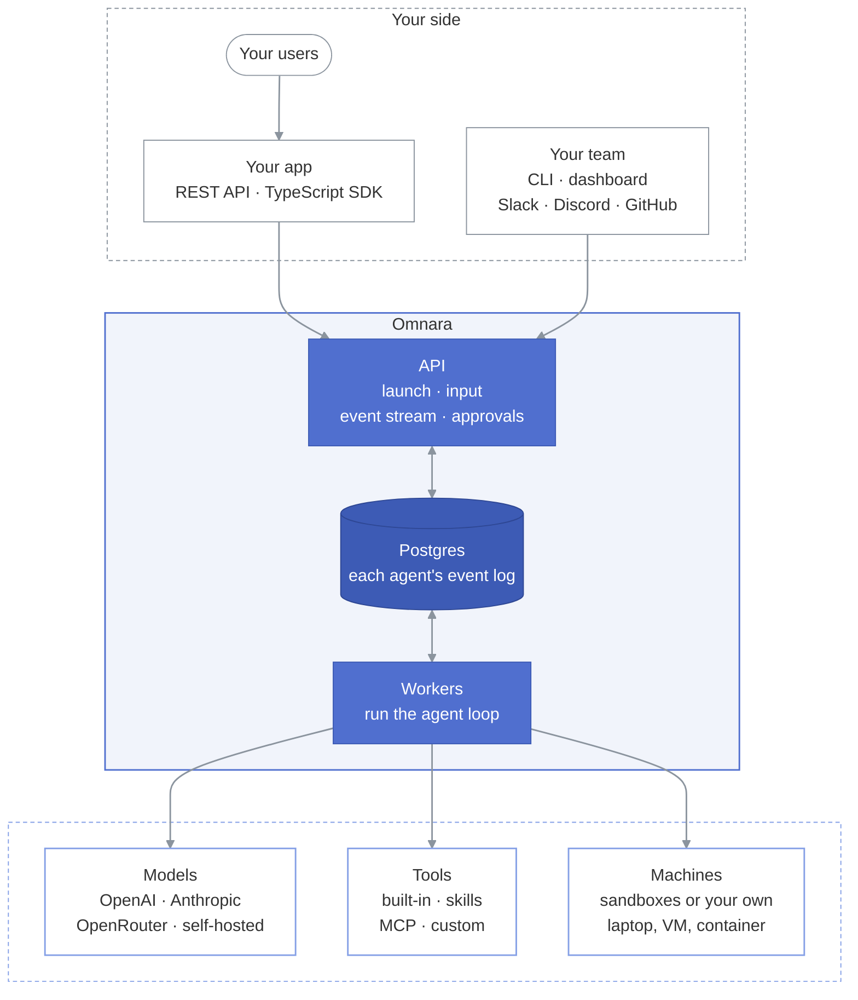

<p align="center">
  <a href="https://www.omnara.com">
    <picture>
      <source media="(prefers-color-scheme: dark)" srcset="https://raw.githubusercontent.com/omnara-ai/omnara/main/frontend/apps/web/public/omnara-logo-white.png">
      
    </picture>
  </a>
</p>

<h1 align="center">The open-source managed agent platform</h1>

<p align="center">A self-hostable alternative to Claude Managed Agents and OpenAI's Agents API.</p>

<p align="center">
  <a href="LICENSE"></a>
  <a href="https://www.npmjs.com/package/@omnara/sdk"></a>
  <a href="https://discord.gg/Dc46sYk6e3"></a>
</p>

<p align="center">
  <a href="https://www.omnara.com">Website</a> ·
  <a href="https://docs.omnara.com/quickstart">Quickstart</a> ·
  <a href="https://docs.omnara.com/introduction">Docs</a> ·
  <a href="https://docs.omnara.com/api/overview">API</a> ·
  <a href="https://docs.omnara.com/changelog">Changelog</a> ·
  <a href="https://discord.gg/Dc46sYk6e3">Discord</a>
</p>

Omnara is an open-source managed agent platform. It runs durable AI agents
through one API on any model and any machine, with tools, secrets, approvals,
and streaming built in. Self-host it for free under Apache 2.0, or use
[Omnara Cloud](https://app.omnara.com).

Put agents inside your product, run them from Slack, Discord, or GitHub, or
start them on a schedule. Omnara keeps each agent's state and runs its tools;
your application decides who can use each agent and what they see.

## Quickstart

### Omnara Cloud

Sign in at [app.omnara.com](https://app.omnara.com). Your first project comes
with a model provider (`omnara-openrouter`) and a pool of managed sandboxes
(`default-pool`), so this config runs as is. Save it as `agent.yaml`:

```yaml
version: v1
instruction: |
  You are an engineering assistant. Use your machine to run commands.
model:
  provider_config: omnara-openrouter
  name: anthropic/claude-fable-5.1
machine_sources:
  - machine_pool_name: default-pool
```

Launch it with the CLI (Node.js 22 or newer). If you're not logged in, the
first command opens your browser to sign in.

```sh
npx omnara agents launch --file agent.yaml \
  --name "Machine assistant" \
  --message "Report this machine's operating system and free disk space."
```

Chat with the agent in your terminal with `npx omnara agents chat <agent-id>`,
or open it in the dashboard to watch its tool calls and reply. The
[quickstart](https://docs.omnara.com/quickstart) shows the same flow with the
REST API and the TypeScript SDK.

To have your coding agent do the setup, give it this prompt:

```text
Help me set up Omnara by following https://www.omnara.com/SKILL.md
```

### Self-host

Requires Docker with Compose.

```sh
git clone https://github.com/omnara-ai/omnara.git
cd omnara
docker compose -f compose.yaml --profile app up -d
```

Open [http://localhost:8000](http://localhost:8000) and sign up. Local
development prints the verification link in `docker compose logs api`, so no
email provider is needed. To build from source instead of using published
images, run `docker compose --profile app up -d --build`.

A new self-hosted instance has no model provider or machines yet. Add a model
provider and a machine pool (or connect your own machine) in the console, then
point the CLI at your instance:

```sh
npx omnara config --api-url http://localhost:8000/api/v1 --issuer-url http://localhost:8000
```

The local defaults are intentionally insecure. For a real deployment, follow
the [self-hosting guide](https://docs.omnara.com/self-hosting/deployment) and
the [configuration reference](https://docs.omnara.com/self-hosting/configuration).

## How it works

Omnara saves every step of every agent (each message, model call, tool call,
and result) to Postgres. That record is the agent's state, so any worker can
pick the agent back up after a crash or restart, and machines can be added or
removed while it runs. Models, tools, and machines are settings in the agent's
config.


```mermaid
flowchart TB
    subgraph yours["Your side"]
        users(["Your users"]) --> app["Your app<br/>REST API · TypeScript SDK"]
        team["Your team<br/>CLI · dashboard<br/>Slack · Discord · GitHub"]
    end
    subgraph omnara["Omnara"]
        api["API<br/>launch · input<br/>event stream · approvals"] <--> pg[("Postgres<br/>each agent's event log")] <--> worker["Workers<br/>run the agent loop"]
    end
    subgraph plug[" "]
        models["Models<br/>OpenAI · Anthropic<br/>OpenRouter · self-hosted"]
        tools["Tools<br/>built-in · skills<br/>MCP · custom"]
        machines["Machines<br/>sandboxes or your own<br/>laptop, VM, container"]
    end
    app --> api
    team --> api
    worker --> models
    worker --> tools
    worker --> machines

    classDef side fill:none,stroke:#8b949e,stroke-width:1px
    classDef core fill:#506FCF,stroke:#3D5BB5,stroke-width:1px,color:#ffffff
    classDef store fill:#3D5BB5,stroke:#2E4794,stroke-width:1px,color:#ffffff
    classDef plugin fill:none,stroke:#85A0E6,stroke-width:1.5px
    class users,app,team side
    class api,worker core
    class pg store
    class models,tools,machines plugin
    style yours fill:none,stroke:#8b949e,stroke-dasharray:4 3
    style omnara fill:#506FCF14,stroke:#506FCF,stroke-width:1.5px
    style plug fill:none,stroke:#85A0E6,stroke-dasharray:4 3
    linkStyle default stroke:#8b949e,stroke-width:1.5px
```

- **Your side.** Your app owns the user experience and decides who can use
  each agent. Custom tools run in your own systems; Omnara holds each call
  durably until your code posts the result.
- **API.** Every action is a REST call: create configs, launch agents, send
  input, and resolve approvals. Events stream back over server-sent events.
- **Postgres.** The source of truth. Each agent's event history lives here,
  so any worker can pick up any agent after a crash or restart.
- **Workers.** Stateless processes that claim ready agent work, build the
  model context, call the model, and run tools. They scale horizontally.
- **Machines.** Sandboxes from a provider pool, which Omnara provisions and
  cleans up, or your own computers. Each runs the `omnarad` daemon, which
  connects outbound, so you never open inbound ports.
- **Models and tools.** Any compatible model endpoint, plus built-in tools,
  skills, and MCP servers. Each tool can run immediately, ask a person first,
  or be blocked.

Omnara also uses Redis, blob storage for attachments and tool outputs, and a
memory filesystem; see the
[architecture docs](https://docs.omnara.com/self-hosting/architecture).

## Features

### Build agents

- **[Any model](https://docs.omnara.com/organization/model-providers).** Bring
  your own keys for OpenAI, Anthropic, OpenRouter, LiteLLM, Ollama, or any
  OpenAI Responses, OpenAI Chat Completions, or Anthropic Messages compatible
  endpoint, including models you host yourself.
- **[Tools](https://docs.omnara.com/tools/built-in).** Built-in tools for shell
  commands, files, web search and fetch, and asking a person a question, plus
  [MCP servers](https://docs.omnara.com/tools/mcp) and
  [custom tools](https://docs.omnara.com/tools/custom) that run in your own
  systems.
- **[Skills](https://docs.omnara.com/tools/skills).** Package instructions and
  files once, attach them to any agent, and the agent loads them when it needs
  them.
- **[Memory](https://docs.omnara.com/agents/configuration#memory-stores).**
  Memory stores give agents files that persist between conversations and can
  be shared with other agents, with read or read-write access per agent.
- **[Subagents](https://docs.omnara.com/agents/configuration#subagents).** An agent
  can start subagents with a fresh context, check their progress, and send them
  new instructions. Each subagent is a full agent you can inspect.

### Run them anywhere

- **[Machines](https://docs.omnara.com/machines/overview).** Machines are tools
  the agent uses. Install the Omnara daemon on any laptop, VM, or container and
  your agents can run commands and edit files there, with no inbound ports or
  SSH keys. Or use sandboxes from nine providers (Arker, Blaxel, boxd, CreateOS,
  Daytona, Freestyle, Modal, Tenki, Unikraft). An agent can use several machines
  at once (for example, a set of GPU servers) and move between them: if your
  laptop goes offline, it can continue in a sandbox and sync back with git.
- **[Durable state](https://docs.omnara.com/agents/overview).** Every step is
  saved, so agents recover from crashes, restarts, and machine disconnects
  without losing work.
- **[Schedules](https://docs.omnara.com/api-reference/endpoints/configs-and-profiles/create-cron-trigger).**
  Cron triggers with time zones can message an existing agent, launch a new one
  from a profile, or
  [start a new Slack or Discord thread](https://docs.omnara.com/integrations/overview#start-a-new-thread-on-a-schedule).

### Connect them

- **[Slack, Discord, and GitHub](https://docs.omnara.com/integrations/overview).**
  Mention the bot in Slack or Discord to start an agent in a thread, where it
  replies, asks questions, and requests approvals. On GitHub, an agent can start
  when a pull request opens or someone mentions it, then read the diff,
  comment, and submit reviews. To connect another service, build a
  [custom integration](https://docs.omnara.com/integrations/custom-integrations)
  on the same public API.
- **[Streaming](https://docs.omnara.com/events/streaming) and
  [webhooks](https://docs.omnara.com/events/webhooks).** Stream every event as
  it happens or receive it as a webhook, and send new messages while the agent
  works.
- **[Approvals](https://docs.omnara.com/events/interactions).** Each tool can
  run immediately, ask a person first, or be blocked. The platform enforces the
  setting, and the agent waits until someone responds.
- **[API, SDK, and CLI](https://docs.omnara.com/api/overview).** A REST API
  defined in [`api/openapi/openapi.yaml`](api/openapi/openapi.yaml), a
  TypeScript SDK ([`@omnara/sdk`](https://www.npmjs.com/package/@omnara/sdk)),
  a CLI ([`omnara`](https://www.npmjs.com/package/omnara)), and an MCP server.

### Control them

- **Access control and [secrets](https://docs.omnara.com/organization/secrets).**
  Organization and project roles for users and API keys. Credentials for
  models, machines, and MCP servers are stored once and shared with each
  project explicitly.
- **Your data.** Self-hosted deployments keep every agent's history in your own
  Postgres, where you can query it for analytics, evals, and training datasets.

## Omnara vs Claude Managed Agents and OpenAI's Agents API

[Claude Managed Agents](https://platform.claude.com/docs/en/managed-agents/overview)
and OpenAI's [Agents API](https://developers.openai.com/api/docs/guides/agents-api/overview)
are hosted services for running agents on one company's models. Omnara does the
same job as an open-source platform you can run anywhere, with any model.

| | Omnara | Claude Managed Agents | OpenAI's Agents API |
| --- | --- | --- | --- |
| Source | Open source (Apache 2.0) | Closed | Open-source harness (Codex); the hosted service is OpenAI's |
| Models | Any compatible model | Claude | OpenAI |
| Agent loop | Omnara's, works with any model | Anthropic's, built for Claude | Codex, run and updated by OpenAI |
| Where the platform runs | Omnara Cloud, or your own infrastructure | Anthropic's cloud | OpenAI's cloud |
| Where agents run | Sandboxes from many providers, or your own machines | Anthropic sandboxes, or your own sandboxes | OpenAI sandboxes, partner sandboxes, or your own machines |
| Operations | Managed on Omnara Cloud; you operate it when self-hosting | Managed by Anthropic; you run the sandbox side if you self-host sandboxes | Managed by OpenAI; you run the environment if you bring your own |
| Agent history | Stored by Omnara on Omnara Cloud and queryable through the API; in your own Postgres when self-hosted | Stored by Anthropic, readable and deletable through the API; not currently eligible for Zero Data Retention or HIPAA BAA coverage | Stored by OpenAI; no Zero Data Retention support; US data residency only |
| Pricing | Free to self-host. On Omnara Cloud, free with your own keys and machines; pay as you go for our models and sandboxes | Claude token rates plus $0.08 per active session-hour | OpenAI model rates, plus standard rates for OpenAI tools and hosted sandboxes |

Choose Claude Managed Agents or the Agents API if you use one company's models
and want that company to run everything for you. Choose Omnara if you want to
pick your models and machines, run the platform yourself, or keep agent data in
your own database. Details as of October 2026; see each project's
documentation for current features and pricing. Omnara is not affiliated with
Anthropic or OpenAI.

## Where Omnara fits

| If you use | It's good for | Omnara adds |
| --- | --- | --- |
| Workflow builders, such as n8n or Zapier | Predictable, step-by-step automations | Agents that decide their own steps, run code on machines, and keep state for days |
| Agent frameworks, such as Mastra, LangChain, or the OpenAI Agents SDK | Writing one agent in your app's code | Hosting, state, machines, permissions, and integrations, with agents created and changed through an API instead of a redeploy |
| Agent harnesses, such as Claude Code, the Claude Agent SDK, Codex, OpenCode, or Pi | One agent loop in a terminal or on one machine | Cloud agents that run as a service, across machines and users, started from your app, Slack, GitHub, or a schedule |
| Managed agent platforms, such as Claude Managed Agents or the Agents API | Hosted agents on one company's models | The same model of hosted agents, open source, on any model, and self-hostable |

## Examples

Agents you can deploy with one prompt to your coding agent. Each is an
`agent.yaml` plus a `SKILL.md` in [`examples/`](examples).

- [Slack coding agent](examples/slack-coding-agent): mention it in Slack,
  Discord, or a GitHub pull request; it fixes the issue and opens a PR.
- [SRE agent](examples/sre-agent): investigates production symptoms such as a
  5xx spike.
- [Browser agent](examples/browser-agent): a long-running agent that works in a
  real browser.
- [PostHog analytics agent](examples/posthog-analytics-agent): compares
  yesterday's product usage against the 7-day average and reports what
  changed.
- [Reddit](examples/reddit-signal-agent), [X](examples/x-signal-agent), and
  [LinkedIn](examples/linkedin-signal-agent) signal agents: digest the last
  24 hours of relevant posts.
- [Video generation agent](examples/video-generation-agent): makes short
  videos from a brief.

Code samples for specific features: a [CLI chat app](examples/cli-agent) built
on the TypeScript SDK, [custom tools over webhooks](examples/custom-tool-webhook),
and a [SharePoint filesystem mount](examples/sharepoint-mount).

## Use Omnara from your coding agent

**MCP server.** Connect Claude Code, Codex, Cursor, or any MCP client to
`https://app.omnara.com/mcp`, then launch Omnara agents, send them messages,
follow their progress, and manage profiles, secrets, and machines with your
dashboard permissions. Sign in through the browser on first use; there are no
tokens to paste. In Claude, add it from the
[connectors directory](https://claude.ai/directory/app-omnara-com). Omnara is
also listed in the official MCP Registry as `com.omnara/omnara`. See
[Connecting MCP clients](https://docs.omnara.com/api/authentication#connecting-mcp-clients).

```sh
claude mcp add --transport http omnara https://app.omnara.com/mcp
codex mcp add omnara --url https://app.omnara.com/mcp
```

**CLI.** [`omnara`](https://www.npmjs.com/package/omnara) manages agents,
profiles, machines, model providers, secrets, skills, and cron triggers from
your terminal or your coding agent's shell. Run `npx omnara --help` to start.

**Setup skill.** [`skills/setup-omnara-agent`](skills/setup-omnara-agent/SKILL.md),
also served at [omnara.com/SKILL.md](https://www.omnara.com/SKILL.md), walks a
coding agent through setting up Omnara for your project.

**Docs for LLMs.** [docs.omnara.com/llms.txt](https://docs.omnara.com/llms.txt).

## FAQ

**What is Omnara?** An open-source managed agent platform. You define agents in
YAML and launch them through an API; Omnara runs the agent loop, keeps durable
state, connects models, tools, and machines, and streams events back to your
app.

**How much does it cost?** Nothing to self-host. Omnara Cloud has no platform
fee: bring your own model keys and machines for free, or pay as you go for our
models at provider token rates and our sandboxes by active time and retained
storage.
See [pricing](https://www.omnara.com/pricing).

**Can I self-host it?** Yes. Run it with Docker Compose locally, then follow
the [self-hosting guide](https://docs.omnara.com/self-hosting/deployment) for
production. The API, CLI, SDK, and config format are the same on Omnara Cloud
and self-hosted deployments.

**Which models work?** Any model behind an OpenAI Responses, OpenAI Chat
Completions, or Anthropic Messages compatible endpoint, including OpenAI,
Anthropic, OpenRouter, LiteLLM, and Ollama.

## Development

Source development requires the Go version declared in [`go.mod`](go.mod),
Node.js 24 or newer with Corepack, ripgrep, and Docker with Compose. Run the
fast repository gate with `make verify`. See [CONTRIBUTING.md](CONTRIBUTING.md)
for the full test suite, generated-code workflows, and pull request
expectations.

## Community

[Discord](https://discord.gg/Dc46sYk6e3) ·
[GitHub Issues](https://github.com/omnara-ai/omnara/issues) ·
[X](https://x.com/omnaraai) ·
[Security](SECURITY.md)

## License

[Apache License 2.0](LICENSE)
