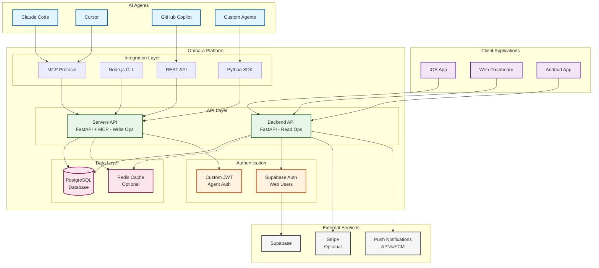
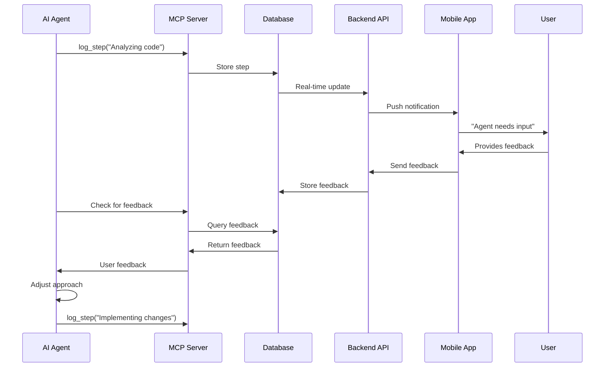
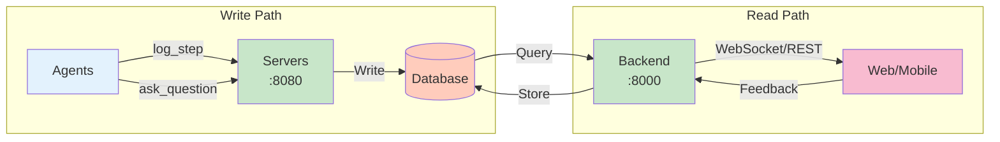

# Omnara Architecture Diagram

```mermaid
graph TB
    subgraph "AI Agents"
        A1[Claude Code]
        A2[Cursor]
        A3[GitHub Copilot]
        A4[Custom Agents]
    end

    subgraph "Client Applications"
        C1[iOS App]
        C2[Web Dashboard]
        C3[Android App]
    end

    subgraph "Omnara Platform"
        subgraph "API Layer"
            API1[Backend API<br/>FastAPI - Read Ops]
            API2[Servers API<br/>FastAPI + MCP - Write Ops]
        end

        subgraph "Authentication"
            AUTH1[Supabase Auth<br/>Web Users]
            AUTH2[Custom JWT<br/>Agent Auth]
        end

        subgraph "Data Layer"
            DB[(PostgreSQL<br/>Database)]
            CACHE[Redis Cache<br/>Optional]
        end

        subgraph "Integration Layer"
            SDK[Python SDK]
            CLI[Node.js CLI]
            MCP[MCP Protocol]
            REST[REST API]
        end
    end

    subgraph "External Services"
        SUP[Supabase]
        STRIPE[Stripe<br/>Optional]
        PUSH[Push Notifications<br/>APNs/FCM]
    end

    %% Agent connections
    A1 --> MCP
    A2 --> MCP
    A3 --> REST
    A4 --> SDK

    %% Integration to Servers
    MCP --> API2
    REST --> API2
    SDK --> API2
    CLI --> API2

    %% Client connections
    C1 --> API1
    C2 --> API1
    C3 --> API1

    %% API to Database
    API1 --> DB
    API2 --> DB
    API1 -.-> CACHE
    API2 -.-> CACHE

    %% Authentication flows
    API1 --> AUTH1
    API2 --> AUTH2
    AUTH1 --> SUP

    %% External services
    API1 --> STRIPE
    API1 --> PUSH

    %% Styling
    classDef agents fill:#e1f5fe,stroke:#01579b,stroke-width:2px
    classDef clients fill:#f3e5f5,stroke:#4a148c,stroke-width:2px
    classDef api fill:#e8f5e9,stroke:#1b5e20,stroke-width:2px
    classDef auth fill:#fff3e0,stroke:#e65100,stroke-width:2px
    classDef data fill:#fce4ec,stroke:#880e4f,stroke-width:2px
    classDef external fill:#f5f5f5,stroke:#424242,stroke-width:2px

    class A1,A2,A3,A4 agents
    class C1,C2,C3 clients
    class API1,API2 api
    class AUTH1,AUTH2 auth
    class DB,CACHE data
    class SUP,STRIPE,PUSH external
```

## Data Flow Diagram

```mermaid
sequenceDiagram
    participant Agent as AI Agent
    participant MCP as MCP Server
    participant DB as Database
    participant API as Backend API
    participant App as Mobile App
    participant User as User

    Agent->>MCP: log_step("Analyzing code")
    MCP->>DB: Store step
    DB->>API: Real-time update
    API->>App: Push notification
    App->>User: "Agent needs input"
    
    User->>App: Provides feedback
    App->>API: Send feedback
    API->>DB: Store feedback
    
    Agent->>MCP: Check for feedback
    MCP->>DB: Query feedback
    DB->>MCP: Return feedback
    MCP->>Agent: User feedback
    
    Agent->>Agent: Adjust approach
    Agent->>MCP: log_step("Implementing changes")
```

## Component Interaction Diagram

```mermaid
graph LR
    subgraph "Write Path"
        A[Agents] -->|log_step| S[Servers<br/>:8080]
        A -->|ask_question| S
        S -->|Write| D[(Database)]
    end

    subgraph "Read Path"
        D -->|Query| B[Backend<br/>:8000]
        B -->|WebSocket/REST| W[Web/Mobile]
        W -->|Feedback| B
        B -->|Store| D
    end

    style A fill:#e3f2fd
    style S fill:#c8e6c9
    style D fill:#ffccbc
    style B fill:#c8e6c9
    style W fill:#f8bbd0
```