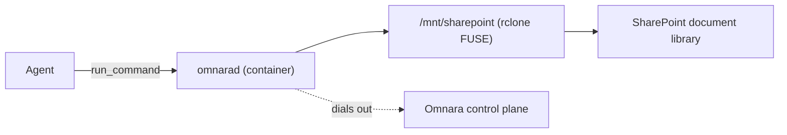

This walkthrough shows how [`examples/sharepoint-mount`](https://github.com/omnara-ai/omnara/tree/main/examples/sharepoint-mount) gives an agent filesystem access to a SharePoint document library. A Docker container runs the Omnara daemon next to an `rclone` FUSE mount, and the agent uses that mount as its working directory. The same bring-your-own-machine pattern works for private networks, databases, and internal APIs.



The daemon connects outbound to the control plane, so the container needs no inbound ports. If it disconnects, the [agent remains durable](/how-omnara-works#the-log-is-the-agent); commands against the machine return retryable errors until it reconnects.

## The pieces

Four files do the work. The [repository README](https://github.com/omnara-ai/omnara/blob/main/examples/sharepoint-mount/README.md) covers the Microsoft authentication options and exact setup:

| File | Role |
| --- | --- |
| `connect-machine.sh` | Builds the image and runs the container with your machine token and SharePoint settings |
| `Dockerfile` | The daemon compiled from the repo, plus `rclone` and FUSE |
| `entrypoint.sh` | In-container startup: mount the library at `/mnt/sharepoint`, start `omnarad` |
| `sharepoint-agent.yaml` | The agent config that targets the machine by name |

## Register the machine

In the console: open **Machines** and click **Connect machine**. Pick the machine *name* — agent configs reference machines by name, so choose something stable — and the project whose agents may use it, then copy the machine token (shown once). The script feeds that token to the daemon:

```sh
cd examples/sharepoint-mount
cp .env.example .env   # machine token + SharePoint credentials
./connect-machine.sh
```

The container needs `--cap-add SYS_ADMIN --device /dev/fuse` because rclone mounts FUSE inside it; the script passes both. These are elevated container permissions, so use a dedicated, trusted container.

## A minimal agent config

Once the machine is online, this minimal config points an agent at the machine and mount:

```yaml
instruction: |
  Help the user inspect and work with files in the mounted SharePoint document
  library. Your working directory is the mounted library. Prefer ordinary
  filesystem commands such as ls, find, cat, and ripgrep (rg). Ask the user
  before making destructive changes.
model:
  provider_config: openai-prod
  name: openai-prod - gpt-5.6
machine_sources:
  - machine_name: sharepoint-docs    # the name from Connect machine
    cwd: /mnt/sharepoint
tools:
  run_command:
    permission:
      mode: always_allow
  write_process: {}
  read_process: {}
  stop_process: {}
  list_processes: {}
  list_machines: {}
  inspect_machine: {}
  ask_question: {}
```

`machine_name` selects this specific machine instead of creating one from a pool. `cwd` makes the mounted library the default directory for commands.

The image includes tools such as `pandoc` and `openpyxl`; the instruction tells the agent how to use them.

Launch an agent from this config ([console or API](/agents/overview#launch-an-agent)) and verify:

```text
Ask the agent: run `pwd && ls -la`
```

It should list the document library's contents from `/mnt/sharepoint`.

The mount is not a one-time copy. When its SharePoint credentials allow writes, files the agent creates or edits are written back to SharePoint. Likewise, changes made in SharePoint appear back in the mount.
