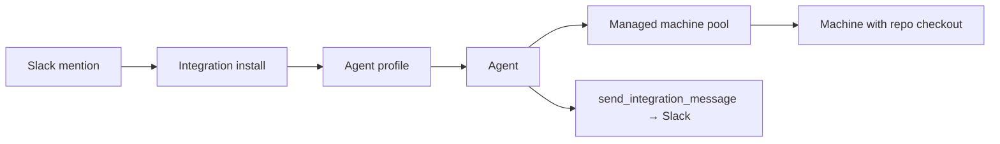

This walkthrough builds a Slack bot that does engineering work on one GitHub repository. Each Slack thread starts a separate durable agent from the same profile.

It is the flagship example because it connects the core platform concepts: secrets, machine pools, profiles, and integrations. The path below uses hosted Omnara's managed pool.



## Define the agent

Replace the model, pool, repository, and secret values with your own:

```yaml
instruction: |
  You are a software engineering agent for one GitHub repository.

  Before starting work, make sure the repository is cloned at
  /workspace/my-repo. If it is not, clone it using GITHUB_PAT. Run repository
  commands from that directory. Never print the token or store it in the
  repository, commits, logs, or configured Git remote.

  Send every user-visible answer or update with send_integration_message so it
  appears in the Slack thread.
model:
  provider_config: openai-prod
  name: gpt-5.6
machine_sources:
  - machine_pool_name: default-pool
    cwd: /workspace
    env_overlay:
      GITHUB_REPO_OWNER: acme
      GITHUB_REPO_NAME: my-repo
    secret_env_overlay:
      GITHUB_PAT: sec_7jehcyd5n6a2bfgik7mv4qtrwz
tools:
  run_command: {}
  write_process: {}
  read_process: {}
  stop_process: {}
  list_processes: {}
  list_machines: {}
  inspect_machine: {}
  ask_question: {}
  send_integration_message: {}
  set_integration_target: {}
```

Things to note:

- **Secrets stay out of the machine image.** Omnara injects the GitHub token at runtime; the config stores only its [secret](/organization/secrets) reference.
- **`send_integration_message` sends replies to Slack.** It uses `always_allow`—the only mode it supports—so replies never wait for approval.

## Set it up

Use the console or API. Both paths create the same profile and connect it to Slack.

<Tabs>
<Tab title="Console">
  <Steps>
    <Step title="Use your onboarding project">
      New organizations already have a managed pool granted to their first project. Use that project for the simplest setup. If you choose another project, [grant the managed pool](/machines/pools#grant-a-pool-to-a-project) first.
    </Step>
    <Step title="Store the GitHub token">
      Open the project's **Project Secrets** page and click **New secret**. Create a **Generic** secret containing a GitHub token with access to the repository, then copy its `sec_…` ID for the config.
    </Step>
    <Step title="Confirm model access">
      On **Models**, copy the model's exact configured name into the YAML and make sure it is granted to the project. If not, click **Grant to project** on its row.
    </Step>
    <Step title="Create the profile">
      Open **Agent profiles** and click **New agent profile**. Switch to the **YAML** tab, paste the YAML above, replace the model, pool, repository, and secret values, then click **Create profile**.
    </Step>
    <Step title="Deploy to Slack">
      On the profile's row, click **Deploy to app** and choose **Slack**. Name the app, paste a Slack app configuration token, and complete the OAuth install. [Slack integration](/integrations/slack) covers this flow in detail.
    </Step>
  </Steps>
</Tab>
<Tab title="API">
  Start with the organization, onboarding project, and managed pool already granted to it:

  ```bash
  export BASE="$OMNARA_API/orgs/$ORG/projects/$PROJ"

  curl "$BASE/machine-pool-grants" \
    -H "Authorization: Bearer $OMNARA_TOKEN"
  ```

  Use the `machine_pool.name` from the response as `machine_pool_name` in the config. If the project has several grants, choose the pool you want.

  <Steps>
    <Step title="Store the GitHub token">
      ```bash
      GITHUB_SECRET_ID=$(
        jq -n \
          --arg project "$PROJ" \
          --arg token "$GITHUB_PAT" \
          '{
            owner: { kind: "project", project_id: $project },
            name: "repo-slack-agent-github-pat",
            material: { kind: "generic", value: $token }
          }' |
        curl "$OMNARA_API/orgs/$ORG/secrets" \
          -H "Authorization: Bearer $OMNARA_TOKEN" \
          -H "Content-Type: application/json" \
          -d @- |
        jq -r '.id'
      )
      ```
    </Step>
    <Step title="Confirm model access">
      The model in `agent.yaml` must already be granted to the project. See [Model providers](/organization/model-providers) if you still need to configure or grant one.
    </Step>
    <Step title="Create the config and profile">
      Save the YAML above as `agent.yaml`, replacing the pool name, repository, and `$GITHUB_SECRET_ID`.

      ```bash
      CONFIG_ID=$(
        jq -n --rawfile source agent.yaml \
          '{ source: $source, source_format: "yaml" }' |
        curl "$BASE/agent-configs" \
          -H "Authorization: Bearer $OMNARA_TOKEN" \
          -H "Content-Type: application/json" \
          -d @- |
        jq -r '.id'
      )

      PROFILE_ID=$(
        curl "$BASE/agent-profiles" \
          -H "Authorization: Bearer $OMNARA_TOKEN" \
          -H "Content-Type: application/json" \
          -d '{"name":"Repo Slack Agent","config":"'"$CONFIG_ID"'"}' |
        jq -r '.id'
      )
      ```
    </Step>
    <Step title="Create and install the Slack app">
      ```bash
      OAUTH_URL=$(
        curl "$BASE/agent-profiles/$PROFILE_ID/slack-setup" \
          -H "Authorization: Bearer $OMNARA_TOKEN" \
          -H "Content-Type: application/json" \
          -d '{
            "app_name": "Repo Slack Agent",
            "app_configuration_token": "'"$SLACK_APP_CONFIGURATION_TOKEN"'"
          }' |
        jq -r '.oauth_url'
      )

      echo "$OAUTH_URL"
      ```

      Open the URL and approve the Slack install. Run this setup call only once for each Slack app you want to create.
    </Step>
  </Steps>
</Tab>
</Tabs>

## What happens on a mention

The first mention in a Slack thread launches an agent from the profile and creates a machine from the managed pool. The agent clones the repository if needed, then starts working.

Slack thread messages become [agent inputs](/events/sending-input) attributed to the Slack user through [actors](/events/sending-input#who-said-that-actors-and-attribution). Replies sent with `send_integration_message` return to the same thread.

To check the setup:

> Ask it to run `pwd && git log -1`. You should see `/workspace/my-repo` and the latest commit.
