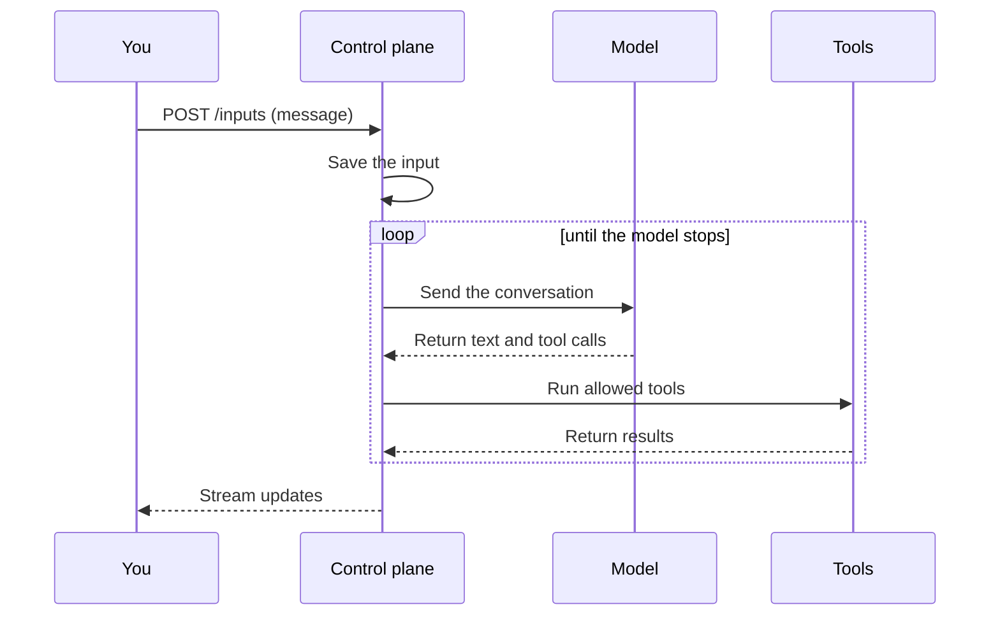
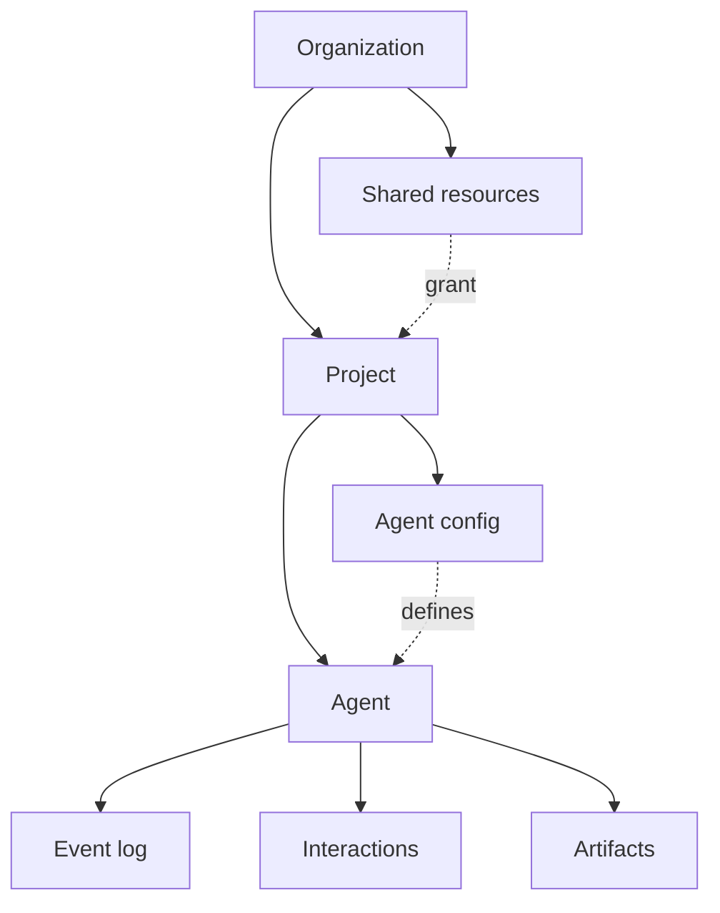

Four ideas explain most of Omnara:

1. An agent's state comes from its event history.
2. The control plane advances the agent loop and saves each step.
3. Machines provide environments for tools like `run_command`.
4. Projects and grants control which resources an agent can use.

## The log is the agent

Each agent has an ordered **event log**: the durable history of everything that enters the conversation and everything the agent does. The console renders this log as the agent's conversation timeline.

The log contains four kinds of events:

- **`agent_input`** — a message, interaction answer, cancel request, or config change entered the conversation.
- **`model_output`** — the model returned text, reasoning, or tool calls.
- **`tool_result`** — a tool finished and returned its result.
- **`context_checkpoint`** — Omnara summarized earlier context so the conversation can continue efficiently.

Omnara uses the event log to determine what the agent has done and what should happen next.

This design has three practical benefits:

- **No single worker or machine owns the agent.** If a worker stops, another can continue from the last saved event.
- **Streams can resume.** Every event has a sequence number, so reconnecting clients can request everything after the last event they received.
- **History remains available.** Archiving an agent stops future work without deleting its event log.

## How the control plane runs the loop

The control plane advances an agent in small steps and saves the result of each one:

A **turn** begins when the agent starts working on an input and ends when the model finishes without requesting another tool.

The turn can pause when:

- The agent needs a person to approve a tool or answer a question. Omnara opens an [interaction](/events/interactions) and waits for a response.
- The agent calls a [custom tool](/tools/custom). Omnara waits for your system to submit the result.

Messages sent while the agent is busy are not lost. **Queued** input waits for the next turn; **steering** input changes the current turn at its next model call. [Sending input](/events/sending-input#queued-vs-steering) explains when to use each.

## Machines are tools, not homes

Agents do not live on machines. Their conversation and loop live in the control plane.

A machine provides an environment for tools such as `run_command`. You can connect your own machine or let Omnara create one from a pool. If it disconnects, the agent remains intact and can continue when the machine reconnects. See [Machines](/machines/overview).

## Organizations, projects, and access

An **organization** groups people, projects, and shared resources. A **project** contains the agents, configs, and profiles for one body of work.

Access has two parts:

- **Roles** decide what a person or service account can do in an organization or project.
- **Grants** make shared models, secrets, machines, pools, and skills available to a project. Resources owned by the project are available directly.

API requests use bearer API keys. Personal keys act with the user's roles; organization keys act as service accounts with their own roles. See [Authentication](/api/authentication) and [Members & access](/organization/members).

## Where to go from here

<CardGroup cols={2}>
  <Card title="Agents" icon="robot" href="/agents/overview">
    Launch, inspect, reconfigure, cancel, and archive agents
  </Card>
  <Card title="Sending input" icon="paper-plane" href="/events/sending-input">
    Send messages and change direction while an agent works
  </Card>
  <Card title="Streaming events" icon="tower-broadcast" href="/events/streaming">
    Read history, follow live activity, and reconnect safely
  </Card>
  <Card title="Agent configuration" icon="file-code" href="/agents/configuration">
    Define an agent's model, tools, permissions, and machines
  </Card>
</CardGroup>
