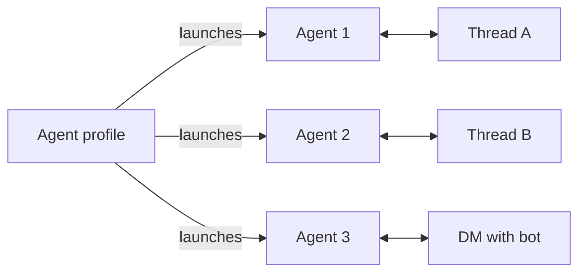

The Slack integration connects an [agent profile](/agents/configuration#profiles) to a bot. Each new Slack conversation launches a separate agent from that profile. The agents start with the profile's current config but keep independent conversations and histories. Later replies return to the agent for that thread or DM.



## Before you start

When you connect Slack, Omnara automatically enables **`send_integration_message`** in the profile's current config.

<Note>
  **Self-hosting?** Set `OMNARA_PUBLIC_URL` to a public HTTPS origin so Slack can deliver webhooks. Hosted Omnara is already configured.
</Note>

## Connect Slack

### Create the Slack App with Omnara

Get a **Slack app configuration token** from [api.slack.com/apps](https://api.slack.com/apps) under **Your App Configuration Tokens**. Omnara uses it to create and configure the Slack app for you.

<Tabs>
<Tab title="Console">
  <Steps>
    <Step title="Open the deploy dialog">
      On the **Agent Profiles** page, open the profile's row actions and click **Deploy to app**. Pick **Slack** as the destination.
    </Step>
    <Step title="Name the bot and paste the token">
      Set the **App name** (this becomes the bot's Slack name), paste the app configuration token — the dialog links to Slack's app settings if you still need one — and optionally add an icon. Click **Continue**.
    </Step>
    <Step title="Approve in Slack">
      The console sends you to Slack's OAuth screen; approve the install into your workspace. You land back in the console with the install live under the profile's integrations.
    </Step>
  </Steps>
</Tab>
<Tab title="API">
  One call creates the app and returns the install link:

  ```bash
  curl "$OMNARA_API/orgs/$ORG/projects/$PROJ/agent-profiles/aprf_3jehcyd5n6a2bfgik7mv4qtrwz/slack-setup" \
    -H "Authorization: Bearer $OMNARA_TOKEN" \
    -H "Content-Type: application/json" \
    -d '{
      "app_name": "Release Research",
      "app_configuration_token": "xoxe.xoxp-..."
    }'
  ```

  ```json
  {
    "provider": "slack",
    "slack_app_id": "A0919XJRZ3T",
    "oauth_url": "https://slack.com/oauth/v2/authorize?client_id=…&scope=…&state=…",
    "redirect_uri": "https://app.omnara.com/api/integrations/oauth/callback",
    "events_url": "https://app.omnara.com/api/integrations/slack/events",
    "actions_url": "https://app.omnara.com/api/integrations/slack/actions",
    "expires_at": "2026-08-03T21:41:00Z"
  }
  ```

  Open `oauth_url` within 10 minutes while signed in to Omnara as the user who started setup. Approve the Slack install, and the browser returns to the console.
</Tab>
</Tabs>

Each setup creates a new Slack app, so run it only once for each bot you want.

### Use an existing Slack app

If you already have a Slack app, provide its credentials instead. This path is API-only:

```bash
curl "$OMNARA_API/orgs/$ORG/projects/$PROJ/agent-profiles/aprf_3jehcyd5n6a2bfgik7mv4qtrwz/integration-oauth/setup" \
  -H "Authorization: Bearer $OMNARA_TOKEN" \
  -H "Content-Type: application/json" \
  -d '{
    "client_id": "1234567890.0987654321",
    "client_secret": "…",
    "signing_secret": "…"
  }'
```

Configure your app with the returned event, action, and redirect URLs, then open `oauth_url` to approve the install. Both setup paths connect one Slack workspace to the profile.

<Note>
  Removing a Slack integration from Omnara keeps its agents and histories, but does not uninstall the app from Slack. Remove it separately in Slack if you are decommissioning the bot.
</Note>

## How Slack conversations map to agents

- The first mention in a channel thread launches an agent from the profile. Later replies return to the same agent without another mention.
- A DM keeps one persistent agent for the whole conversation.
- Messages in other threads are ignored until someone mentions the bot.

Slack messages are attributed to their sender and appear in the same [timeline](/events/streaming) as console activity. [Questions and approvals](/events/interactions) can be answered in Slack or the console; either response resumes the same agent.

<Info>
Full schema and playground: [Create Slack app and OAuth setup](/api-reference/endpoints/configs-and-profiles/create-slack-app-and-oauth-setup) · [Create integration OAuth setup](/api-reference/endpoints/configs-and-profiles/create-integration-oauth-setup).
</Info>
