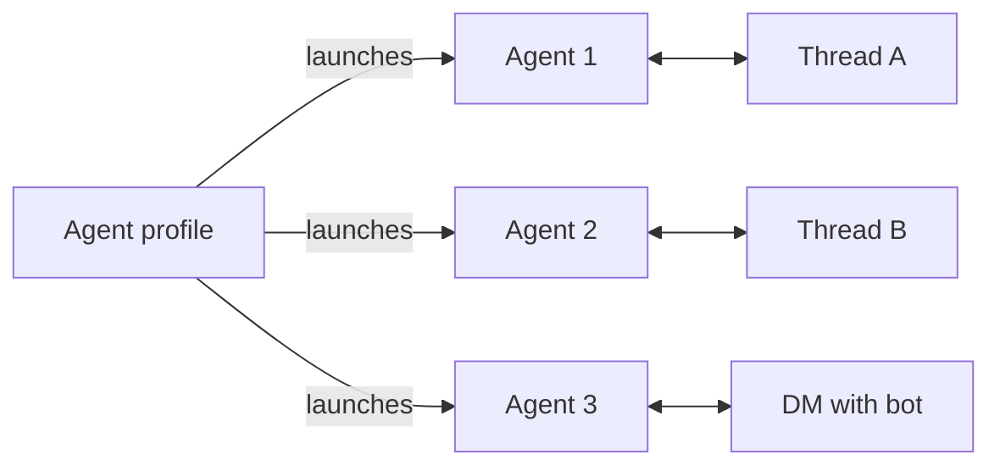

import SlackCreateApp from "/snippets/slack-create-app.mdx";
import SlackExistingApp from "/snippets/slack-existing-app.mdx";

The Slack integration connects an [agent profile](/agents/configuration#profiles) to a bot. Each new Slack conversation launches a separate agent from that profile. The agents start with the profile's current config but keep independent conversations and histories. Later replies return to the agent for that thread or DM.

For a complete runnable example that ends in a Slack channel — an X (Twitter) listening agent with a daily digest — see [`examples/x-signal-agent`](https://github.com/omnara-ai/omnara/tree/main/examples/x-signal-agent).

## Before you start

Agents receive the [channel toolkit](/tools/built-in#integrations) from their active channel bindings: `list_channels`, `get_channel`, `set_current_channel`, and the permitted `read_channel` and `send_channel_message` operations. Toolkit membership follows live channel grants and is not configured in the profile. Sends require a `channel_id` and `message`; the current channel selects where future question and approval prompts are copied.

Conversations migrated from the previous Slack integration keep their existing
receive and send access. The upgrade does not automatically add history-reading
access; grant read access explicitly to enable `read_channel` for those agents.
New conversations created by the built-in Slack behavior start with read access.

<Note>
  **Self-hosting?** Set `OMNARA_PUBLIC_URL` to a public HTTPS origin and
  configure the [channel gateway](/self-hosting/configuration#channel-gateway)
  on API, worker, and gateway services. Slack's signed event and action URLs
  remain on the Go API; the gateway processes saved events and executes bounded
  channel operations.
</Note>

## Connect Slack

### Create the Slack App with Omnara

Get a **Slack app configuration token** from [api.slack.com/apps](https://api.slack.com/apps) under **Your App Configuration Tokens**. Omnara uses it to create and configure the Slack app for you.

<Tabs>
<Tab title="API">
  The examples assume the client, `$ORG`/`orgID`, and `$PROJ`/`projectID` setup from the [quickstart](/quickstart). One call creates the app and returns the install link:

<SlackCreateApp />

Open `oauth_url` within 10 minutes while signed in to Omnara as the user who started setup. Approve the Slack install, and the browser returns to the dashboard. The CLI opens the link in your browser for you; `--no-browser` prints the authorization URL instead.

</Tab>
<Tab title="Dashboard">
  <Steps>
    <Step title="Open the deploy dialog">
      On the **Agent Profiles** page, open the profile's row actions and click **Deploy to app**. Pick **Slack** as the destination.
    </Step>
    <Step title="Name the bot and paste the token">
      Set the **App name** (this becomes the bot's Slack name), paste the app configuration token — the dialog links to Slack's app settings if you still need one — and optionally add an icon. Click **Continue**.
    </Step>
    <Step title="Approve in Slack">
      The dashboard sends you to Slack's OAuth screen; approve the install into your workspace. You land back in the dashboard with the install live under the profile's integrations.
    </Step>
  </Steps>
</Tab>
</Tabs>

Each setup creates a new Slack app, so run it only once for each bot you want.

### Use an existing Slack app

If you already have a Slack app, register it once under the organization's
**Apps** page with its app ID, OAuth client ID and credential secret. Then connect
it from the project's **Integrations** page and choose its inbound agent profile.
The API also supports direct setup with existing app credentials:

<SlackExistingApp />

Your Slack app must already be configured with Omnara's event, action, and redirect URLs — the setup response returns them. Then open `oauth_url` to approve the install; the CLI opens the approval page in your browser and waits until the integration is created.

Both setup paths connect one Slack workspace to the profile.

When repeating profile-specific setup to reconnect an existing bot, select its
currently assigned profile. Setup rejects a different profile; change the launch
profile separately on the project's **Integrations** page.

<Note>
  Removing a Slack integration from Omnara keeps its agents and histories, but
  does not uninstall the app from Slack. Remove it separately in Slack if you
  are decommissioning the bot.
</Note>

## How Slack conversations map to agents

- The first mention in a channel thread launches an agent from the profile. Later replies return to the same agent without another mention.
- A DM keeps one persistent agent for the whole conversation.
- Messages in other threads are ignored until someone mentions the bot.

Channel permissions and input routing are separate. Giving an agent permission to
send does not subscribe it to replies. The built-in Slack behavior delivers replies
to agents connected to receive from that thread; a thread with only send or read
access still follows the normal first-mention behavior. In that case, the mention
starts a separate agent; the original sender keeps its existing permissions.
If a thread's receiving agents have been archived or their receive access revoked,
messages do not automatically launch replacements. Customer-managed listeners
choose which events to submit, even when their agents have receive permission.
To continue an existing thread with another agent, attach that agent to its
channel with receive access using the [channel binding API](/integrations/external#give-an-agent-access-and-deliver-input).

Slack messages are attributed to their sender and appear in the same [timeline](/events/streaming) as dashboard activity. [Questions and approvals](/events/interactions) can be answered in Slack or the dashboard; either response resumes the same agent.

<Info>
  Full schema and playground: [Create Slack app and OAuth
  setup](/api-reference/endpoints/configs-and-profiles/create-slack-app-and-oauth-setup)
  · [Create integration OAuth
  setup](/api-reference/endpoints/configs-and-profiles/create-integration-oauth-setup).
</Info>
