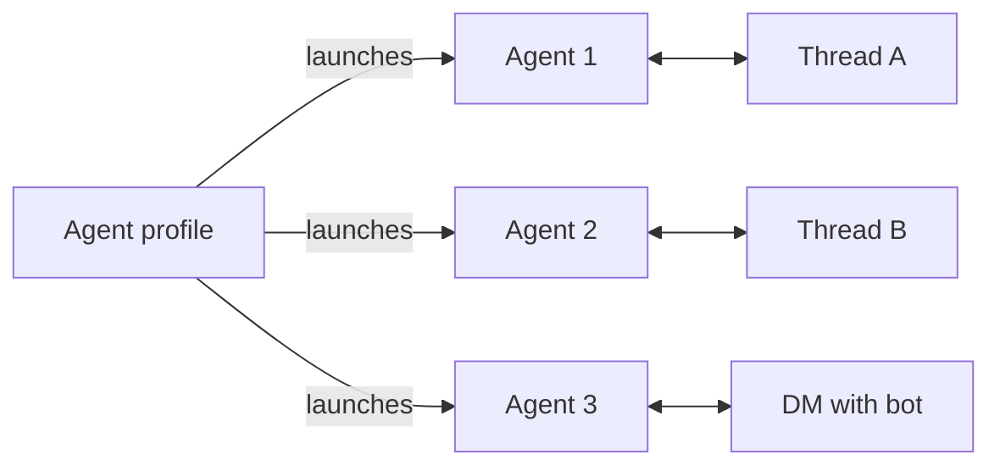

import SlackCreateApp from '/snippets/slack-create-app.mdx'
import SlackExistingApp from '/snippets/slack-existing-app.mdx'

The Slack integration connects an [agent profile](/agents/configuration#profiles) to a bot. Each new Slack conversation launches a separate agent from that profile. The agents start with the profile's current config but keep independent conversations and histories. Later replies return to the agent for that thread or DM.

For a complete runnable example that ends in a Slack channel — an X (Twitter) listening agent with a daily digest — see [`examples/x-signal-agent`](https://github.com/omnara-ai/omnara/tree/main/examples/x-signal-agent).

## Before you start

Agents handling Slack conversations automatically receive **`send_integration_message`** unless it is explicitly disabled in the profile's config. You do not need to add it yourself.

<Note>
  **Self-hosting?** Set `OMNARA_PUBLIC_URL` to a public HTTPS origin so Slack can deliver webhooks. Hosted Omnara is already configured.
</Note>

## Connect Slack

### Create the Slack App with Omnara

Get a **Slack app configuration token** from [api.slack.com/apps](https://api.slack.com/apps) under **Your App Configuration Tokens**. Omnara uses it to create and configure the Slack app for you.

<Tabs>
<Tab title="API">
  The examples assume the client, `$ORG`/`orgID`, and `$PROJ`/`projectID` setup from the [quickstart](/quickstart). One call creates the app and returns the install link:

  <SlackCreateApp />

  Open `oauth_url` within 10 minutes while signed in to Omnara as the user who started setup. Approve the Slack install, and the browser returns to the dashboard. The CLI opens the link in your browser for you; `--no-browser` prints the authorization URL instead.
</Tab>
<Tab title="Dashboard">
  <Steps>
    <Step title="Open the deploy dialog">
      On the **Agent Profiles** page, open the profile's row actions and click **Deploy to app**. Pick **Slack** as the destination.
    </Step>
    <Step title="Name the bot and paste the token">
      Set the **App name** (this becomes the bot's Slack name), paste the app configuration token — the dialog links to Slack's app settings if you still need one — and optionally add an icon. Click **Continue**.
    </Step>
    <Step title="Approve in Slack">
      The dashboard sends you to Slack's OAuth screen; approve the install into your workspace. You land back in the dashboard with the install live under the profile's integrations.
    </Step>
  </Steps>
</Tab>
</Tabs>

Each setup creates a new Slack app, so run it only once for each bot you want.

### Use an existing Slack app

If you already have a Slack app, provide its credentials instead. This path is not available in the dashboard:

<SlackExistingApp />

Your Slack app must already be configured with Omnara's event, action, and redirect URLs — the setup response returns them. Then open `oauth_url` to approve the install; the CLI opens the approval page in your browser and waits until the integration is created.

Both setup paths connect one Slack workspace to the profile.

<Note>
  Removing a Slack integration from Omnara keeps its agents and histories, but does not uninstall the app from Slack. Remove it separately in Slack if you are decommissioning the bot.
</Note>

## How Slack conversations map to agents

- The first mention in a channel thread launches an agent from the profile. Later replies return to the same agent without another mention.
- A DM keeps one persistent agent for the whole conversation.
- Messages in other threads are ignored until someone mentions the bot.

Slack messages are attributed to their sender and appear in the same [timeline](/events/streaming) as dashboard activity. [Questions and approvals](/events/interactions) can be answered in Slack or the dashboard; either response resumes the same agent.

<Info>
Full schema and playground: [Create Slack app and OAuth setup](/api-reference/endpoints/configs-and-profiles/create-slack-app-and-oauth-setup) · [Create integration OAuth setup](/api-reference/endpoints/configs-and-profiles/create-integration-oauth-setup).
</Info>
