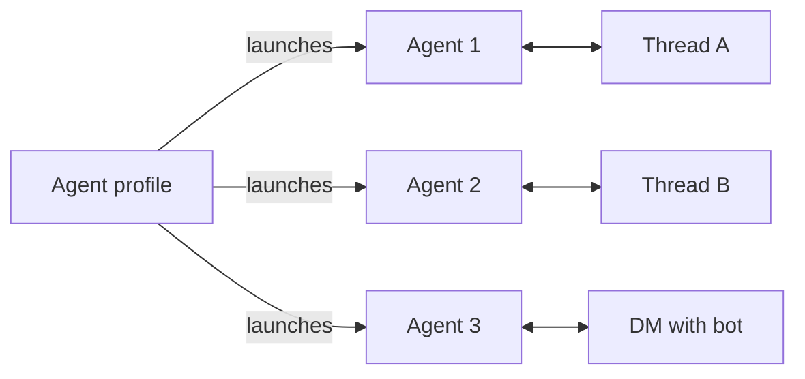

import SlackCreateApp from '/snippets/slack-create-app.mdx'
import SlackExistingApp from '/snippets/slack-existing-app.mdx'

Create a Slack integration from your project's **Integrations** page to start agents from
mentions and continue conversations in Slack threads.


```mermaid
graph LR
    P["Agent profile"] -->|launches| A1["Agent 1"]
    P -->|launches| A2["Agent 2"]
    P -->|launches| A3["Agent 3"]
    A1 <--> T1["Thread A"]
    A2 <--> T2["Thread B"]
    A3 <--> DM["DM with bot"]
```

For complete examples you can deploy, see [Coding agent in Slack](/examples/slack-coding-agent), which answers in threads and opens pull requests, and the [X signal agent](/examples/x-signal-agent), which posts a daily digest to a channel.

## Connect Slack

### Dashboard

Choose **Slack bot** and keep the suggested Omnara name `slack-bot` or enter your
own, such as `engineering`. This permanent name identifies the integration and its tools.

- To create a Slack app, enter **Name in Slack**, the name teammates will see,
  and an app configuration token from [Slack's app settings](https://api.slack.com/apps).
  Omnara configures the app's URLs and event subscriptions for you.
- To use an existing app, choose **Enter app details**, copy its Client ID,
  Client Secret and Signing Secret from **Basic Information**, and complete the
  [Slack settings checklist](#existing-app-checklist) below.

Choose **Create and connect**, then authorize the app in Slack. Authorization
continues in the same tab and returns to the saved integration to choose launch
profiles. The bot token obtained through OAuth grants access to that workspace;
the app configuration token is only used to create the registration.

### Existing app checklist

In [Slack's app settings](https://api.slack.com/apps), use the URLs shown in
Omnara or returned by the API setup request:

1. Under **OAuth & Permissions**, add `redirect_uri` to **Redirect URLs**.
2. Under **Event Subscriptions**, enable events, set **Request URL** to `events_url`,
   and add all of these under **Subscribe to bot events**:

   - `app_mention`
   - `app_uninstalled`
   - `channel_rename`
   - `group_rename`
   - `message.channels`
   - `message.groups`
   - `message.im`
   - `message.mpim`
   - `tokens_revoked`
   - `user_profile_changed`

3. Under **Interactivity & Shortcuts**, enable interactivity and set **Request URL**
   to `actions_url`.
4. Under **App Home**, enable the **Messages Tab** and allow users to send messages
   if you want DMs with the bot.

Use HTTP event delivery with **Socket Mode** off. Save the changes before authorizing.
OAuth grants permissions; it does not select
[event subscriptions](https://docs.slack.dev/apis/events-api/#subscribing-to-event-types).

### CLI or API

With the CLI or API, create the Omnara integration first:

```json
{"name":"engineering","integration_kind":"slack_thread","settings":{}}
```

Submit that body to `POST /orgs/{orgID}/projects/{projectID}/integrations`, then use its
returned `itg_…` ID for setup. To create a Slack registration:

<SlackCreateApp />

For an existing Slack registration:

<SlackExistingApp />

For an existing app, complete the [checklist above](#existing-app-checklist) using
the returned URLs. Newly created apps already include these settings.
Open `oauth_url` before `expires_at`, signed in to Omnara as the user who started
setup, and approve installation. The CLI opens this link unless `--no-browser`
is supplied. The integration becomes active when its `last_oauth_flow_id` matches the
returned flow. Setup updates that specific saved integration and does not create a launcher.
For self-hosting, `OMNARA_PUBLIC_URL` must be a public HTTPS origin.

Reauthorizing creates a new encrypted project secret and updates the integration to use
it. A superseded secret remains in Secrets until you delete it; Omnara prevents
deletion while another resource still references it. Disconnecting preserves
the credential reference for reconnect, while deleting the integration releases it.

## Start agents from mentions

Choose profiles in the integration's launch settings. Mention launches are available
wherever the bot can receive messages in the connected workspace. Invite the bot
to the channels where it should respond. A channel mention starts
work in that thread; a DM to the bot can start work without a mention. With one
profile, the agent starts immediately. With several, the
first reply asks which profile to use; no agent starts before the selection.
Anyone in the conversation can choose. Menus expire after an hour, and follow-up
messages sent before the choice may be missed. Edit offered profiles for future
requests without changing existing conversations.

Selecting profiles enables mention launches; there is no separate enable switch.
Leave the selection empty to use only scheduled launches. Removing the last
profile removes the mention launcher, without affecting schedules or existing
conversations. With no matching subscription or launcher, messages receive no response.

A launch derives a config with read/post tools and a Slack interaction handler,
and attaches a thread subscription before the first input. Existing explicit
config entries are preserved. Thread
replies steer the selected agent and cancel its outstanding interactions. Bot
messages are ignored. Overlapping launchers using the same bot are discouraged.

For API setup, send the settings to
`PUT /orgs/{orgID}/projects/{projectID}/integrations/{integrationID}`:

```json
{
  "settings": {
    "launcher": {
      "profiles": ["aprf_aeaqcaibaeaqcaibaeaqcaibae"]
    }
  }
}
```

Profiles are ordered, distinct public IDs. Slack launchers contain only `profiles`;
channel access is managed in Slack.
Updates replace `settings`; send `{"settings":{}}` to remove the mention launcher.

## Scheduled threads

Use **Add schedule** on the integration page to post a template opening message and launch
one profile in its new thread. The tools, reply subscription and interaction handler
are ready when the agent starts. Schedules can coexist with mention launches.
Choose a channel the bot has already joined, not a DM. The opening-message
template is limited to 2,000 characters.
See [scheduled integration launches](/integrations/overview#start-a-new-thread-on-a-schedule)
for setup, template variables and recovery behavior.

## Thread tools and subscriptions

A mention or scheduled launch supplies `read` and `post_message` for its assigned
thread. `read` accepts `cursor` and `limit`; `post_message` accepts `text` and an
optional `paths` array of up to 20 files. Use exact `/artifacts/<artifact_id>` or
`/memory/<store>/<file>` paths; directories and globs are not supported. For example,
`{"text":"Update","paths":["/memory/reports/weekly.pdf"]}` posts the message and file
directly to that thread. Omit `paths` for a text-only message.
Thread reads start at the oldest messages. Pass `next_cursor` back as `cursor`
to reach later replies; the first page may not include recent activity.
The model cannot choose another channel or thread. Adding these tools to an agent
without an assigned conversation is insufficient; calls fail before contacting Slack.

The launcher also subscribes the agent to replies. Sending messages does not
change subscriptions. Removing the sending tool or changing the config leaves
subscriptions intact. Use **Stop forwarding** on the integration page or the
[subscriptions API](/integrations/overview#stop-forwarding) to remove one.

The subscriptions API can independently forward messages to an existing agent:

```json
{
  "agent_id": "YOUR_AGENT_ID",
  "conversation": {"channel_id": "C123", "thread_ts": "111.222333"}
}
```

Slack forwards messages from the subscribed conversation. Attaching a subscription
does not assign or change the conversation used by this integration's tools.

## Questions and approvals

For an agent assigned to the `engineering` integration's conversation, add
`interaction_handlers: {engineering: {}}` to offer Slack questions and approvals.
For manual configs, also select `list_interaction_handlers` and
`set_interaction_handler` under `tools` to let the model choose a destination.
The Slack launcher adds the handler and both tools automatically, preserving explicit settings.
The handler uses the conversation assigned when the integration launches the agent.
Select it with `{"handler":"engineering","args":{}}`; the model does not supply
channel or thread IDs. The list tool shows the assigned destination. Adding a
handler to a manual config does not create an assignment or grant another conversation.
With automatic selection enabled, the last eligible content input admitted into a new
turn selects its handler. Inputs from the dashboard, API, or an integration without
an eligible handler select dashboard-only delivery. Ordinary scheduled instructions
and internal agent messages/reports without an integration origin preserve the
selection. An explicit integration origin takes precedence, including a scheduled
launch in a new thread. Waiting inputs do not change the current turn. Set
`auto_select: false` with `set_interaction_handler` to pin a choice; set it to `true`
to resume automatic selection. Omitting it keeps the current mode. The list tool
reports the mode. The dashboard always remains available.

Slack interaction notifications run independently of the waiting agent. Delivery is
best effort: overload can delay or drop notifications, and restarts can interrupt sending.
Omnara retries only safe failures, with a bounded retry budget. If delivery may
have succeeded, it does not automatically post another copy; a crash during
sending can leave a prompt missing or unconfirmed. The interaction remains
answerable in the [dashboard and API](/events/interactions) regardless of delivery.
