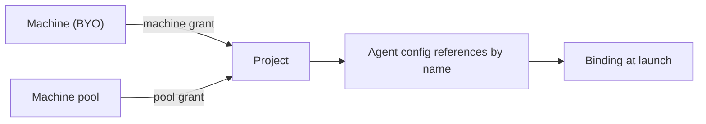

A machine is an environment where agents run tools such as `run_command`. It can be a laptop on your desk, a VM in your VPC, a cloud sandbox created on demand or any other environment with access to a shell.

Every machine runs the same small daemon, `omnarad`, which connects outbound to the control plane. You do not need to open inbound ports, distribute SSH keys, or give Omnara a network path into your infrastructure.

Most importantly, **the machine does not own the agent**. Agents live in the control plane as [event logs](/how-omnara-works#the-log-is-the-agent); machines are execution environments they can attach and release. Disconnecting a machine does not kill the agent.

## Two ways to get one

| | BYO (bring your own) | Pool |
| --- | --- | --- |
| What it is | A computer you already have, registered by installing the daemon | Capacity provisioned on demand from Blaxel, Unikraft Cloud, or Daytona |
| Created by | You, via the [install flow](/machines/connect) | Omnara, when an agent needs one |
| Lifetime | Yours to manage | Created on demand — at launch or mid-conversation — and deleted when released |
| Best for | Access to things only your infra can reach — mounts, internal networks, GPUs | Disposable, scale-to-zero execution |
| `source_kind` | `byo` | `pool` |

The [mounted storage example](/examples/mounted-storage) is the canonical BYO story; the [repo Slack agent](/examples/repo-slack-agent) is the canonical pool story.

## Machine state

Every machine reports two independent states:

- **`lifecycle_state`** tracks whether the machine is being provisioned, active, being deleted, or deleted. It also reports provisioning and deletion failures.
- **`connection_state`** reports whether the machine is currently `online`, `asleep`, or `offline`.

An `active` machine can be `offline`, for example when someone closes a laptop. New commands fail with a retryable error. A process may continue on the machine, but the agent cannot interact with it until the daemon reconnects. After a grace period, tool calls waiting on that process return a retryable `machine_unreachable` result.

A machine is available to an agent only when its binding is attached, its project grant still exists, its lifecycle is `active`, and its daemon is `online` or the machine is asleep and can be woken. The [`inspect_machine`](/tools/built-in#list_machines--inspect_machine) tool reports this as `executable`.

## Who may use a machine

Machines and pools are **org-level** resources; projects get access through explicit grants:



A [machine grant](/machines/connect#grant-the-machine-to-a-project) lets a project's agents use one specific machine. A [pool grant](/machines/pools#grant-a-pool-to-a-project) lets them create machines from a pool, optionally with tighter limits and project-specific environment variables. Agent configs reference granted machines and pools by name in `machine_sources`. Omnara checks access when the config is created and again when an agent launches.

## Bindings: how an agent holds a machine

At launch, each BYO machine and each pool machine requested through `initial_num_machines` becomes an **agent machine binding**. Agents can create more pool machines later with [`create_machine`](/tools/built-in#create_machine).

A binding stores the working directory and environment for that agent. It also gets a short `machine_ref`, such as `mchr-x7k2p3`, which tools use to select the machine:

```json
"machine_bindings": [
  {
    "machine_ref": "mchr-x7k2p3",
    "binding_kind": "pool",
    "state": "attached",
    "cwd": "/workspace",
    "...": "..."
  }
]
```

Bindings remain `attached` until released. Releasing a pool binding schedules its machine for deletion; releasing a BYO binding only detaches it from the agent. Archiving an agent releases all of its bindings. The [command and process tools](/tools/built-in#commands) use these bindings.

## Reading order

<CardGroup cols={2}>
  <Card title="Connect a machine" icon="plug-circle-plus" href="/machines/connect">
    Register a BYO machine and grant it to a project
  </Card>
  <Card title="Machine pools" icon="layer-group" href="/machines/pools">
    On-demand capacity from Blaxel, Unikraft, or Daytona
  </Card>
  <Card title="Built-in tools" icon="terminal" href="/tools/built-in#commands">
    The command and process tools, from the agent's point of view
  </Card>
  <Card title="Mounted storage example" icon="folder-tree" href="/examples/mounted-storage">
    A complete BYO walkthrough
  </Card>
</CardGroup>
