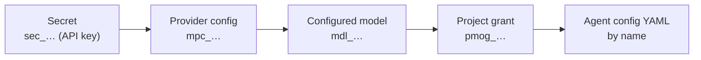

Omnara works with the model providers you choose. Before an agent can use a model, your organization connects the provider, configures the model, and grants it to the project:



The organization owns the credentials and model settings. Projects receive access through grants, and agent configs reference the provider and model by name.

The console guides you through this chain. The [CLI](/quickstart) and API expose the same resources for automation; CLI examples assume you have run `omnara login` and `omnara config select`.

## Connect a provider

<Tabs>
<Tab title="Console">
  <Steps>
    <Step title="Open the provider dialog">
      Go to **Models** in the sidebar and click **New provider**. Pick a provider and name the connection — this name (e.g. `openai-prod`) is what agent configs reference as `model.provider_config`.
    </Step>
    <Step title="Create the credential inline">
      In the API key field, click **New secret**, name it, paste the provider's API key, and click **Create secret**. It's stored as an organization [secret](/organization/secrets) (`sec_…`); the provider only ever holds the reference.
    </Step>
    <Step title="Add provider">
      Click **Add provider**. Omnara creates the provider and tries to discover its models. If discovery fails, the provider is still created and you can add models manually.
    </Step>
  </Steps>
</Tab>
<Tab title="CLI">
  Store the API key as a secret, then create a provider that references it. `--preset` supplies the endpoint, API format, and authentication settings:

  ```bash
  omnara secrets create \
    --owner-kind org \
    --name openai-api-key \
    --material-kind generic \
    --material-value "sk-..."
  ```

  Keep the returned `id`, then:

  ```bash
  omnara model-providers create \
    --name openai-prod \
    --preset openai \
    --credential-secret-id sec_hcyd5n6a2bfgik7mv4qtrwz3je \
    --json
  ```

  ```json
  {
    "config": {
      "id": "mpc_bfgik7mv4qtrwz3jehcyd5n6a2",
      "name": "openai-prod",
      "api_format": "openai-responses",
      "base_url": "https://api.openai.com/v1",
      "endpoint_path": "/responses",
      "credential_secret_id": "sec_hcyd5n6a2bfgik7mv4qtrwz3je",
      "...": "..."
    },
    "model_catalog": {
      "status": "ok",
      "models": [
        { "slug": "gpt-5.6", "display_name": "GPT-5.6" }
      ]
    }
  }
  ```

  Presets are available for `openai`, `anthropic`, and `openrouter`. For a proxy, local vLLM server, or another compatible endpoint, set the API format, base URL, endpoint path, and authentication method yourself with `--api-format`, `--base-url`, `--endpoint-path`, and `--auth-kind`.

  Omnara fetches the provider's model catalog when it creates the provider, and on demand with `omnara model-providers catalog <model-provider-config-id>`. The catalog probe can fail without failing the request, which allows private or air-gapped endpoints. Check `model_catalog.status`; you can configure models manually if needed.

  A provider cannot be deleted while it still has configured models.
</Tab>
<Tab title="API">
  Store the API key as a secret, then create a provider that references it. `preset` supplies the endpoint, API format, and authentication settings:

  ```bash
  curl "$OMNARA_API/orgs/$ORG/secrets" \
    -H "Authorization: Bearer $OMNARA_TOKEN" \
    -H "Content-Type: application/json" \
    -d '{
      "owner": { "kind": "org" },
      "name": "openai-api-key",
      "material": { "kind": "generic", "value": "sk-..." }
    }'
  ```

  Keep the returned `id`, then:

  ```bash
  curl "$OMNARA_API/orgs/$ORG/model-provider-configs" \
    -H "Authorization: Bearer $OMNARA_TOKEN" \
    -H "Content-Type: application/json" \
    -d '{
      "name": "openai-prod",
      "preset": "openai",
      "credential_secret_id": "sec_hcyd5n6a2bfgik7mv4qtrwz3je"
    }'
  ```

  ```json
  {
    "config": {
      "id": "mpc_bfgik7mv4qtrwz3jehcyd5n6a2",
      "name": "openai-prod",
      "api_format": "openai-responses",
      "base_url": "https://api.openai.com/v1",
      "endpoint_path": "/responses",
      "credential_secret_id": "sec_hcyd5n6a2bfgik7mv4qtrwz3je",
      "...": "..."
    },
    "model_catalog": {
      "status": "ok",
      "models": [
        { "slug": "gpt-5.6", "display_name": "GPT-5.6" }
      ]
    }
  }
  ```

  Presets are available for `openai`, `anthropic`, and `openrouter`. For a proxy, local vLLM server, or another compatible endpoint, set the API format, base URL, endpoint path, and authentication method yourself.

  Omnara fetches the provider's model catalog when it creates the provider, and on demand via `GET …/model-provider-configs/{id}/model-catalog`. The catalog probe can fail without failing the request, which allows private or air-gapped endpoints. Check `model_catalog.status`; you can configure models manually if needed.

  A provider cannot be deleted while it still has configured models.
</Tab>
</Tabs>

## Configure models

A configured model (`mdl_…`) gives a provider model a name and runtime settings. Agent configs use `name`; Omnara sends `provider_model_slug` to the provider. Keeping them separate lets you manage provider details centrally.

<Tabs>
<Tab title="Console">
  In **Add models**, select the detected models you want, or click **Skip for now**. Agent YAML must use the configured model name exactly.

  To add or tune a model later, go to **Models > Configured models** and click **New model**. Choose the provider, set the name and provider model slug, and use the advanced section for token limits and capabilities. You can also attach project grants in this dialog.
</Tab>
<Tab title="CLI">
  ```bash
  omnara models create mpc_bfgik7mv4qtrwz3jehcyd5n6a2 \
    --name "openai-prod - gpt-5.6" \
    --provider-model-slug gpt-5.6 \
    --context-window-tokens 272000 \
    --max-output-tokens 32768 \
    --supports-reasoning \
    --default-reasoning-effort medium \
    --default-cache-retention short \
    --json
  ```

  ```json
  {
    "id": "mdl_fgik7mv4qtrwz3jehcyd5n6a2b",
    "name": "openai-prod - gpt-5.6",
    "provider_model_slug": "gpt-5.6",
    "context_window_tokens": 272000,
    "supports_reasoning": true,
    "default_reasoning_effort": "medium",
    "current_revision_id": "mrev_gik7mv4qtrwz3jehcyd5n6a2bf",
    "...": "..."
  }
  ```
</Tab>
<Tab title="API">
  ```bash
  curl "$OMNARA_API/orgs/$ORG/model-provider-configs/mpc_bfgik7mv4qtrwz3jehcyd5n6a2/models" \
    -H "Authorization: Bearer $OMNARA_TOKEN" \
    -H "Content-Type: application/json" \
    -d '{
      "name": "gpt-5.6",
      "provider_model_slug": "gpt-5.6",
      "context_window_tokens": 272000,
      "max_output_tokens": 32768,
      "supports_reasoning": true,
      "default_reasoning_effort": "medium",
      "default_cache_retention": "short"
    }'
  ```

  ```json
  {
    "id": "mdl_fgik7mv4qtrwz3jehcyd5n6a2b",
    "name": "gpt-5.6",
    "provider_model_slug": "gpt-5.6",
    "context_window_tokens": 272000,
    "supports_reasoning": true,
    "default_reasoning_effort": "medium",
    "current_revision_id": "mrev_gik7mv4qtrwz3jehcyd5n6a2bf",
    "...": "..."
  }
  ```
</Tab>
</Tabs>

Changing a model's runtime settings creates a new **revision** (`mrev_…`). Agents resolve the current revision before each model call, so the new settings apply to later calls from existing agents too.

## Grant models to projects

A project needs a model grant (`pmog_…`) before its configs can use the model.

<Tabs>
<Tab title="Console">
  Two ways to the same grant:

  - From the model: **Models > Configured models >** row action **Grant to project** (or attach **Project grants** while creating the model).
  - From the project: in the project's sidebar, open **Grants**, switch to the **Models** tab, and click **Grant models**. This tab also shows the project's existing model grants. Click **Delete grant** to remove one.
</Tab>
<Tab title="CLI">
  ```bash
  omnara grant models add --configured-model-id mdl_fgik7mv4qtrwz3jehcyd5n6a2b --json
  ```

  ```json
  {
    "grant": {
      "id": "pmog_ik7mv4qtrwz3jehcyd5n6a2bfg",
      "configured_model_id": "mdl_fgik7mv4qtrwz3jehcyd5n6a2b",
      "...": "..."
    }
  }
  ```

  A grant can apply stricter settings for one project, such as lower token limits, disabled reasoning, or fewer input and output types — pass flags such as `--max-output-tokens` or `--no-supports-reasoning` when creating it. Settings you omit inherit from the configured model. Use `omnara grant models list` to see a project's grants and `omnara grant models delete <model-grant-id>` to revoke one.

  Revoking a grant prevents the project from creating new configs with that model. It does not change agents that already use it.
</Tab>
<Tab title="API">
  ```bash
  curl "$OMNARA_API/orgs/$ORG/projects/$PROJ/model-grants" \
    -H "Authorization: Bearer $OMNARA_TOKEN" \
    -H "Content-Type: application/json" \
    -d '{"configured_model_id": "mdl_fgik7mv4qtrwz3jehcyd5n6a2b"}'
  ```

  ```json
  {
    "grant": {
      "id": "pmog_ik7mv4qtrwz3jehcyd5n6a2bfg",
      "configured_model_id": "mdl_fgik7mv4qtrwz3jehcyd5n6a2b",
      "...": "..."
    }
  }
  ```

  A grant can apply stricter settings for one project, such as lower token limits, disabled reasoning, or fewer input and output types. Settings you omit inherit from the configured model.

  Revoking a grant prevents the project from creating new configs with that model. It does not change agents that already use it.
</Tab>
</Tabs>

## Use it from a config

With the chain complete, this config can now be created in the project:

```yaml
model:
  provider_config: openai-prod
  name: gpt-5.6
```

When you create the config, Omnara checks the provider, model, and project grant. If something is missing, the validation error tells you what to fix.

<Info>
Full schema and playground: [Create model provider config](/api-reference/endpoints/models/create-model-provider-config) · [Create configured model](/api-reference/endpoints/models/create-configured-model) · [Project model grants](/api-reference/endpoints/models/create-project-model-grant).
</Info>
