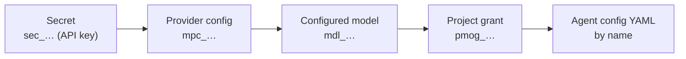

import ModelProvidersSecret from '/snippets/model-providers-secret.mdx'
import ModelProvidersCreate from '/snippets/model-providers-create.mdx'
import ModelProvidersModel from '/snippets/model-providers-model.mdx'
import ModelProvidersGrant from '/snippets/model-providers-grant.mdx'

Omnara works with the model providers you choose. Before an agent can use a model, your organization connects the provider, configures the model, and grants it to the project:



The organization owns the credentials and model settings. Projects receive access through grants, and agent configs reference the provider and model by name.

The dashboard guides you through this chain. The [CLI](/quickstart) and API expose the same resources for automation; CLI examples assume you have run `omnara login` and `omnara config select`.

## Connect a provider

<Tabs>
<Tab title="API">
  The examples assume the client, `$ORG`/`orgID`, and `$PROJ`/`projectID` setup from the [quickstart](/quickstart).

  Store the API key as a secret, then create a provider that references it. The preset supplies the endpoint, API format, and authentication settings:

  <ModelProvidersSecret />

  Keep the returned `id`, then:

  <ModelProvidersCreate />

  Presets are available for `openai`, `anthropic`, and `openrouter`. For a proxy, local vLLM server, or another compatible endpoint, set the API format, base URL, endpoint path, and authentication method yourself.

  Omnara fetches the provider's model catalog when it creates the provider, and on demand with `omnara model-providers catalog {model-provider-config-id}`, `GET …/model-provider-configs/{id}/model-catalog`, or `sdk.getModelCatalog`. The catalog probe can fail without failing the request, which allows private or air-gapped endpoints. Check `model_catalog.status`; you can configure models manually if needed.

  A provider cannot be deleted while it still has configured models.
</Tab>
<Tab title="Dashboard">
  <Steps>
    <Step title="Open the provider dialog">
      Go to **Models** in the sidebar and click **New provider**. Pick a provider and name the connection — this name (e.g. `openai-prod`) is what agent configs reference as `model.provider_config`.
    </Step>
    <Step title="Create the credential inline">
      In the API key field, click **New secret**, name it, paste the provider's API key, and click **Create secret**. It's stored as an organization [secret](/organization/secrets) (`sec_…`); the provider only ever holds the reference.
    </Step>
    <Step title="Add provider">
      Click **Add provider**. Omnara creates the provider and tries to discover its models. If discovery fails, the provider is still created and you can add models manually.
    </Step>
  </Steps>
</Tab>
</Tabs>

Provider timeouts apply to each attempt, including reasoning and response streaming:

- `request_timeout_ms` sets the total deadline, defaulting to 3600000 (60 minutes).
- `idle_timeout_ms` limits the wait for response headers or the next response bytes, defaulting to 300000 (5 minutes). Heartbeats count as activity; local response processing does not consume this idle budget. Increase it for endpoints that can remain silent for longer periods.

Both values must be positive. Edit them in the provider dialog or through the API. Existing configured total deadlines are retained on upgrade. A timed-out attempt can enter the existing bounded retry policy, so a task can run longer than one request deadline.

## Configure models

A configured model (`mdl_…`) gives a provider model a name and runtime settings. Agent configs use `name`; Omnara sends `provider_model_slug` to the provider. Keeping them separate lets you manage provider details centrally.

<Tabs>
<Tab title="API">
  <ModelProvidersModel />
</Tab>
<Tab title="Dashboard">
  In **Add models**, select the detected models you want, or click **Skip for now**. The detected slug is used as the configured model name. Agent YAML must use the configured model name exactly.

  To add a model later, go to **Models > Configured models** and click **New model**. Choose the provider, set the name and provider model slug, and review the context window and maximum output capacity. Use **Advanced** to set an optional default output allowance. You can also attach project grants in this dialog.
</Tab>
</Tabs>

Token settings have separate roles:

- `context_window_tokens` is the shared input and output window and must be at least 2.
- `max_output_tokens` is the model's known output capacity and is optional for every API format. Unknown capacity is returned as `null`; a `null` update clears it. Selecting a discovered model can prefill its published capacity. Creating a model without capacity leaves it unknown.
- `default_max_output_tokens` is an optional request allowance, set only when explicitly configured. Discovery never populates it. Without an override, Omnara uses the known capacity and fits the allowance to the remaining context. When both settings are absent, Chat Completions and Responses omit the allowance and use the provider default.

For Messages with neither setting, Omnara looks up the configured provider's
`/models/{model_id}` endpoint and uses its positive `max_tokens` value. Successful
lookups are cached for an hour and unavailable limits for a minute, with a
three-second lookup timeout. Lookup failures or missing limits use a
64,000-token allowance. Bedrock uses this fallback directly because its Messages
route does not expose the same model lookup API. This fallback may exceed the
limit of an unknown model; configure an explicit capacity or allowance in that case.
Runtime lookup and fallback do not update either stored setting. Existing context
fitting and reasoning-budget validation still apply.

Project and agent context overrides can be smaller than an inherited output capacity; request preparation fits the allowance to that smaller window. An explicit default allowance must remain below the effective context window, including when inherited from the model or project.

Compaction summarizes older history with the same configured model. Its output allowance is at most 16,384 tokens, further limited by the effective default allowance, known output ceiling, and half the context window. When needed to fit the first complete turn or smallest safe portion of history, Omnara reduces the summary allowance while preserving the provider minimum and context safety margin. Anthropic Messages summary requests omit explicitly enabled manual thinking; ordinary requests retain it. Adaptive thinking and other providers' reasoning settings remain unchanged. Summaries must contain text, contain no tool calls, and reduce the history. If a summary hits its output limit, Omnara retries with a smaller eligible portion where possible. At the smallest safe portion, a usable partial summary can become the checkpoint so work can continue.

Normal context admission reserves generation headroom independently of a large output capacity. Responses that reach their output limit retain the `max_tokens` stop reason. Omnara preserves their text and reusable reasoning and continues the conversation. When there are no tool calls, the next request includes a harness notice explaining that the preceding response may be incomplete. These notices are derived from recorded outputs and remain in later request history; they do not create user inputs or error events.

Tool calls are handled individually, including in responses that reach the output limit. Complete, valid calls follow the usual permission and execution flow. Invalid arguments and unavailable tools receive a paired failed tool result so the model can correct the call. Calls rejected during response parsing are recorded together with their failed results and never execute. Missing call identities or malformed provider envelopes use the provider-error and retry flow. A response with tools continues after all results settle; a response without tools stops when the provider reports `end_turn`.

Changing a model's runtime settings creates a new **revision** (`mrev_…`). Agents resolve the current revision before each model call, so the new settings apply to later calls from existing agents too.

## Grant models to projects

A project needs a model grant (`pmog_…`) before its configs can use the model.

<Tabs>
<Tab title="API">
  <ModelProvidersGrant />

  A grant can apply stricter settings for one project, such as lower token limits, disabled reasoning, or fewer input and output types — set them when creating the grant (for example, with the CLI's `--max-output-tokens` or `--no-supports-reasoning` flags). Settings you omit inherit from the configured model. `omnara grant models list` shows a project's grants and `omnara grant models delete {model-grant-id}` revokes one.

  Revoking a grant prevents the project from creating new configs with that model. It does not change agents that already use it.
</Tab>
<Tab title="Dashboard">
  Two ways to the same grant:

  - From the model: **Models > Configured models >** row action **Grant to project** (or attach **Project grants** while creating the model).
  - From the project: in the project's sidebar, open **Grants**, switch to the **Models** tab, and click **Grant models**. This tab also shows the project's existing model grants. Click **Delete grant** to remove one.
</Tab>
</Tabs>

## Use it from a config

With the chain complete, this config can now be created in the project:

```yaml
model:
  provider_config: openai-prod
  name: gpt-5.6
```

When you create the config, Omnara checks the provider, model, and project grant. If something is missing, the validation error tells you what to fix.

<Info>
Full schema and playground: [Create model provider config](/api-reference/endpoints/models/create-model-provider-config) · [Create configured model](/api-reference/endpoints/models/create-configured-model) · [Project model grants](/api-reference/endpoints/models/create-project-model-grant).
</Info>
