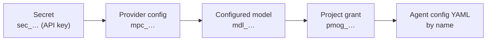

import ModelProvidersSecret from '/snippets/model-providers-secret.mdx'
import ModelProvidersCreate from '/snippets/model-providers-create.mdx'
import ModelProvidersModel from '/snippets/model-providers-model.mdx'
import ModelProvidersGrant from '/snippets/model-providers-grant.mdx'

Omnara works with the model providers you choose. Before an agent can use a model, your organization connects the provider, configures the model, and grants it to the project:


```mermaid
graph LR
    S["Secret<br/>sec_… (API key)"] --> C["Provider config<br/>mpc_…"]
    C --> M["Configured model<br/>mdl_…"]
    M --> G["Project grant<br/>pmog_…"]
    G --> Y["Agent config YAML<br/>by name"]
```

The organization owns the credentials and model settings. Projects receive access through grants, and agent configs reference the provider and model by name.

The dashboard guides you through this chain. The [CLI](/quickstart) and API expose the same resources for automation; CLI examples assume you have run `omnara login` and `omnara config select`.

## Connect a provider

<Tabs>
<Tab title="API">
  The examples assume the client, `$ORG`/`orgID`, and `$PROJ`/`projectID` setup from the [quickstart](/quickstart).

  Store the API key as a secret, then create a provider that references it. The preset supplies the endpoint, API format, and authentication settings:

  <ModelProvidersSecret />

  Keep the returned `id`, then:

  <ModelProvidersCreate />

  Presets are available for `openai`, `anthropic`, and `openrouter`. For a proxy, local vLLM server, or another compatible endpoint, set the API format, base URL, endpoint path, and authentication method yourself.

  Omnara fetches the provider's model catalog when it creates the provider, and on demand with `omnara model-providers catalog {model-provider-config-id}`, `GET …/model-provider-configs/{id}/model-catalog`, or `sdk.getModelCatalog`. The catalog probe can fail without failing the request, which allows private or air-gapped endpoints. Check `model_catalog.status`; you can configure models manually if needed.

  A provider cannot be deleted while it still has configured models.
</Tab>
<Tab title="Dashboard">
  <Steps>
    <Step title="Open the provider dialog">
      With **All projects** selected in the project switcher, open **Models** and click **New provider**. Pick a provider and name the connection — this name (e.g. `openai-prod`) is what agent configs reference as `model.provider_config`.
    </Step>
    <Step title="Create the credential inline">
      In the API key field, click **New secret**, name it, paste the provider's API key, and click **Create secret**. It's stored as an organization [secret](/organization/secrets) (`sec_…`); the provider only ever holds the reference.
    </Step>
    <Step title="Add provider">
      Click **Add provider**. Omnara creates the provider and tries to discover its models. If discovery fails, the provider is still created and you can add models manually.
    </Step>
  </Steps>
</Tab>
</Tabs>

Provider timeouts apply to each attempt, including reasoning and response streaming:

- `request_timeout_ms` sets the total deadline, defaulting to 3600000 (60 minutes).
- `idle_timeout_ms` limits the wait for response headers or more response data, defaulting to 300000 (5 minutes). Heartbeats count as activity. Increase it for endpoints that can remain silent for longer periods.

Edit these settings in the provider dialog or through the API. Existing total deadlines are retained on upgrade.

Use `headers` to send extra HTTP headers with every request to the provider, and `secret_headers` to take a header's value from a [secret](/organization/secrets); put keys and tokens in `secret_headers`. Set both in the provider dialog or through the API. If a referenced secret is deleted, requests omit that header.

## Configure models

A configured model (`mdl_…`) gives a provider model a name and runtime settings. Agent configs use `name`; Omnara sends `provider_model_slug` to the provider. Keeping them separate lets you manage provider details centrally.

<Tabs>
<Tab title="API">
  <ModelProvidersModel />
</Tab>
<Tab title="Dashboard">
  In **Add models**, select the detected models you want, or click **Skip for now**. The detected slug is used as the configured model name. Agent YAML must use the configured model name exactly.

  To add models later, select **All projects** in the project switcher, open **Models**, expand the provider's models, and click **Add model**; the provider's own page has the same button above its model list. In **Add models**, the provider is preselected; search the provider's models and check the ones you want, or type a slug that isn't listed and click its **Add … as a custom model** row. Click **Edit** on a selected row to set its **Name**, **Context**, and **Max output**; a row that still needs input shows **Needs details**. Optionally pick projects under **Share with**, then click the add button, which shows the count (for example, **Add 2 models**).

  A provider can have several configured models for the same slug — for example, two names with different limits. Models the provider already has are marked **Added**; check one again to add another configuration under a different name.

  To set the optional **Default output** allowance or change other settings later, open the model's row actions under its provider on the **Models** page and click **Edit**.
</Tab>
</Tabs>

Token settings have separate roles:

- `context_window_tokens` is the shared input and output window.
- `max_output_tokens` is the model's output capacity. It is optional; selecting a discovered model can prefill it.
- `default_max_output_tokens` is an optional output allowance for each request. When omitted, Omnara uses the known output capacity.

Omnara fits the request allowance to the remaining context. If both output settings are omitted, Messages uses 64,000 tokens; Chat Completions and Responses use the provider default. Set an explicit capacity or allowance for Messages endpoints that support less.

Agents automatically continue after an output-limit cutoff.

Changing a model's runtime settings creates a new **revision** (`mrev_…`). Agents resolve the current revision before each model call, so the new settings apply to later calls from existing agents too.

## Grant models to projects

A project needs a model grant (`pmog_…`) before its configs can use the model.

<Tabs>
<Tab title="API">
  <ModelProvidersGrant />

  A grant can apply stricter settings for one project, such as lower token limits, disabled reasoning, or fewer input and output types — set them when creating the grant (for example, with the CLI's `--max-output-tokens` or `--no-supports-reasoning` flags). Settings you omit inherit from the configured model. `omnara grant models list` shows a project's grants and `omnara grant models delete {model-grant-id}` revokes one.

  Revoking a grant prevents the project from creating new configs with that model. It does not change agents that already use it.
</Tab>
<Tab title="Dashboard">
  Two ways to share the same model:

  - From the model: on the organization **Models** page, use the model's row action **Share with project** (or pick projects under **Share with** while creating the model).
  - From the project: in the project's sidebar, open **Models** and click **Share models**. This page also lists the project's shared models. Click **Stop sharing** to remove one.
</Tab>
</Tabs>

## Use it from a config

With the chain complete, this config can now be created in the project:

```yaml
model:
  provider_config: openai-prod
  name: gpt-6-sol
```

When you create the config, Omnara checks the provider, model, and project grant. If something is missing, the validation error tells you what to fix.

<Info>
Full schema and playground: [Create model provider config](/api-reference/endpoints/models/create-model-provider-config) · [Create configured model](/api-reference/endpoints/models/create-configured-model) · [Project model grants](/api-reference/endpoints/models/create-project-model-grant).
</Info>
