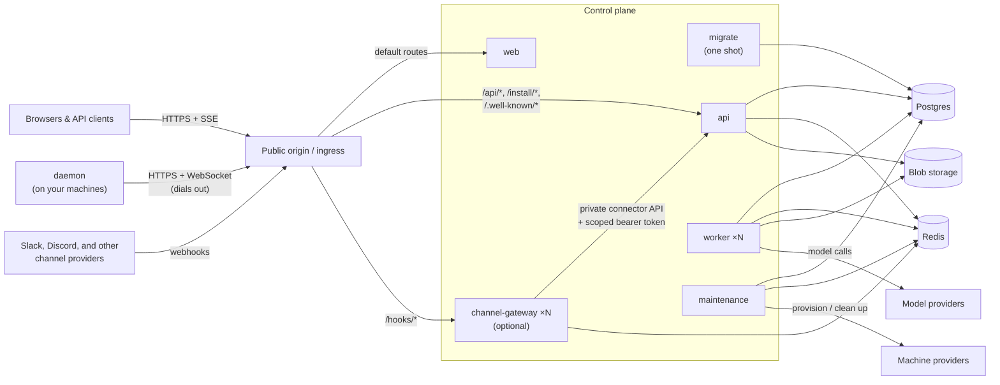

## Processes

**web** serves the compiled single-page application

**api** (`cmd/api`) serves the public API surface

**worker** (`cmd/worker`) executes agent turns: it claims ready agent work, builds the model context, calls the model provider, and runs tools. Workers are stateless and scale horizontally.

**maintenance** (`cmd/maintenance`) reaps expired locks and runtimes, times out stuck work, and reconciles machine pools toward their targets

**channel-gateway** (`frontend/apps/channel-gateway`) is an optional, independently scalable process for provider webhooks, outbound channel delivery, and provider runtimes such as polling or sockets. Its HTTP endpoints use Hono with the Node adapter. It calls the API over the private service network with a narrowly scoped connector token and uses Redis for Chat SDK state. It does not connect to Postgres. Provider adapters are compiled into this process separately; the foundation image does not enable a provider by itself.

**migrate** (`cmd/migrate`) applies the release's schema migrations and exits. Run it successfully before starting or updating the long-running services.

**omnarad** (`cmd/daemon`) runs on each machine agents execute tool calls on. It installs under `~/.omnarad` with a user systemd or launchd service when available, and self-updates from its installer-recorded release manifest.

## Stores

**Postgres** stores all persistent data for the service, like organizations, projects, agents, events, machines, secrets.

Channel customer data follows the project tenancy boundary. Installs, routes, targets, agent bindings, inbound provenance, deliveries, and project-scoped runtime units all carry `project_id`, so they can move with that project's agents to the same database shard. Provider-app registrations and genuinely app-scoped runtime units are control-plane records because one company-owned app can serve several projects. The private connector API hides that placement from the gateway; the gateway never chooses a database or connects to one directly.

**Redis** carries notifications and rate limits. The optional channel gateway also uses namespaced Redis state for Chat SDK runtimes. Redis is coordination and transient state; durable channel routes, inbound provenance, and outbound deliveries remain in Postgres through the API.

**Blob storage** holds artifact content, like file attachments and tool outputs.

## Next steps

<CardGroup cols={2}>
  <Card
    title="Deployment"
    icon="cloud-arrow-up"
    href="/self-hosting/deployment"
  >
    Public origin, reverse proxy rules, and health checks
  </Card>
  <Card title="Configuration" icon="sliders" href="/self-hosting/configuration">
    Every environment variable, grouped
  </Card>
</CardGroup>
