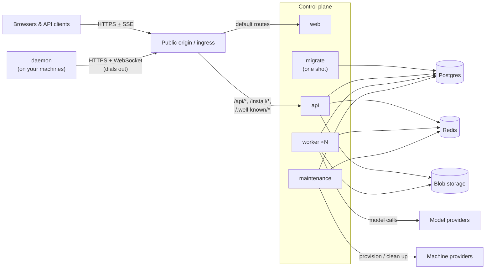

## Processes

**web** serves the compiled single-page application

**api** (`cmd/api`) serves the public API surface

**worker** (`cmd/worker`) executes agent turns: it claims ready agent work, builds the model context, calls the model provider, and runs tools. Workers are stateless and scale horizontally.

**maintenance** (`cmd/maintenance`) reaps expired locks and runtimes, times out stuck work, and reconciles machine pools toward their targets

**migrate** (`cmd/migrate`) applies the release's schema migrations and exits. Run it successfully before starting or updating the long-running services.

**omnarad** (`cmd/daemon`) runs on each machine agents execute tool calls on. It installs under `~/.omnarad` with a user systemd or launchd service when available, and self-updates from its installer-recorded release manifest.

## Stores

**Postgres** stores all persistent data for the service, like organizations, projects, agents, events, machines, secrets.

**Redis** carries notifications and rate limits, this is primarily for SSE streaming and notifications.

**Blob storage** holds artifact content, like file attachments and tool outputs.

## Next steps

<CardGroup cols={2}>
  <Card title="Deployment" icon="cloud-arrow-up" href="/self-hosting/deployment">
    Public origin, reverse proxy rules, and health checks
  </Card>
  <Card title="Configuration" icon="sliders" href="/self-hosting/configuration">
    Every environment variable, grouped
  </Card>
</CardGroup>
