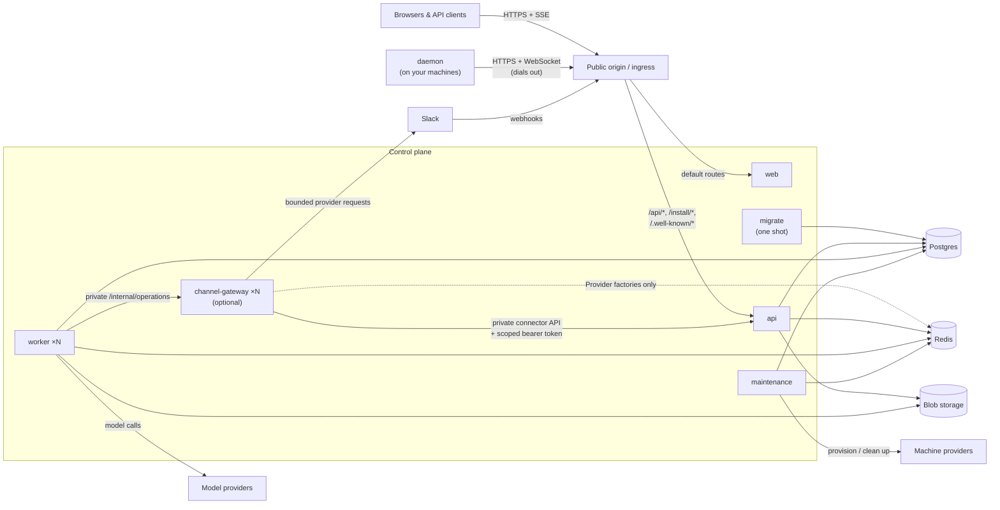

## Processes

**web** serves the compiled single-page application

**api** (`cmd/api`) serves the public API surface

**worker** (`cmd/worker`) executes agent turns: it claims ready agent work, builds the model context, calls the model provider, and runs tools. Workers are stateless and scale horizontally.

**maintenance** (`cmd/maintenance`) reaps expired locks and runtimes, times out stuck work, and reconciles machine pools toward their targets

**channel-gateway** (`frontend/apps/channel-gateway`) processes durable Slack event receipts and executes bounded send, read, and interaction operations. Go retains Slack OAuth, verified intake before acknowledgment, and signed actions. The gateway uses Hono with the Node adapter and calls the private API with a scoped connector token. Workers call its private `/internal/operations` endpoint. The gateway uses Redis for Chat SDK state only when provider factories are registered, and ephemeral files for bounded artifact transfer; it does not connect to Postgres. Generic webhook, polling, and socket factory extension points remain available, but no additional provider factories are enabled.

**migrate** (`cmd/migrate`) applies the release's schema migrations and exits. Run it successfully before starting or updating the long-running services.

**omnarad** (`cmd/daemon`) runs on each machine agents execute tool calls on. It installs under `~/.omnarad` with a user systemd or launchd service when available, and self-updates from its installer-recorded release manifest.

## Stores

**Postgres** stores all persistent data for the service, like organizations, projects, agents, events, machines, secrets.

Channel customer data follows the project tenancy boundary. Connections, routes, channels, agent bindings, inbound receipts, external requests, and project-scoped runtime units all carry `project_id`, so they can move with that project's agents to the same database shard. Provider-app registrations and genuinely app-scoped runtime units are control-plane records because one company-owned app can serve several projects. The private connector API hides that placement from the gateway; the gateway never chooses a database or connects to one directly.

**Redis** carries notifications and rate limits. The optional channel gateway uses namespaced Redis state when Chat SDK runtime factories are registered. Its built-in Slack receipt and operation callbacks do not require Redis. Redis is coordination and transient state; durable channel authority, inbound receipts, and external request lifecycles remain in Postgres through the API. Managed outgoing operations have no durable delivery queue.

**Blob storage** holds artifact content, like file attachments and tool outputs.

## Next steps

<CardGroup cols={2}>
  <Card
    title="Deployment"
    icon="cloud-arrow-up"
    href="/self-hosting/deployment"
  >
    Public origin, reverse proxy rules, and health checks
  </Card>
  <Card title="Configuration" icon="sliders" href="/self-hosting/configuration">
    Every environment variable, grouped
  </Card>
</CardGroup>
