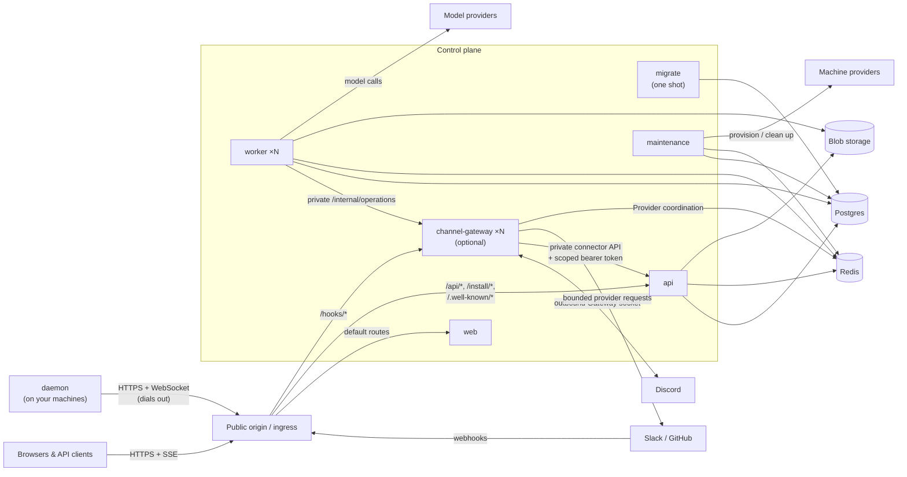

## Processes

**web** serves the compiled single-page application

**api** (`cmd/api`) serves the public API surface

**worker** (`cmd/worker`) executes agent turns: it claims ready agent work, builds the model context, calls the model provider, and runs tools. Workers are stateless and scale horizontally.

**maintenance** (`cmd/maintenance`) reaps expired locks and runtimes, times out stuck work, and reconciles machine pools toward their targets

**channel-gateway** (`frontend/apps/channel-gateway`) handles Slack, Discord, and GitHub communication. It receives GitHub webhooks, runs app-scoped Discord Gateway shards, and processes the durable incoming receipts for all three. Go retains Slack's public OAuth, signature verification and interactive callbacks. Workers call the gateway's private `/internal/operations` endpoint for bounded sends and reads. The gateway uses Redis for transient provider coordination and temporary files for streamed artifacts; it never connects directly to Postgres. Provider SDKs handle native API details, while the shared connector API enforces channel and agent authority.

**migrate** (`cmd/migrate`) applies the release's schema migrations and exits. Run it successfully before starting or updating the long-running services.

**omnarad** (`cmd/daemon`) runs on each machine agents execute tool calls on. It installs under `~/.omnarad` with a user systemd or launchd service when available, and self-updates from its installer-recorded release manifest.

## Stores

**Postgres** stores all persistent data for the service, like organizations, projects, agents, events, machines, secrets.

Channel customer data follows the project tenancy boundary. Connections, routes, channels, agent bindings, message receipts, and external requests all carry `project_id`, so they can move with that project's agents to the same database shard. Provider-app registrations, runtime units, and provider-control receipts are control-plane records because one customer's registered app can serve several projects. Each runtime unit belongs to that app, and every incoming event still checks the receiving project's installation and channel authority. Control receipts track resumable connection updates; each affected project's state still changes through its scoped API operation. The private connector API hides database placement from the gateway; the gateway never chooses a database or connects to one directly.

**Redis** carries notifications and rate limits. The channel gateway also uses it for transient provider coordination. Durable channel authority, incoming receipts and external request lifecycles remain in Postgres through the API. Managed outgoing operations have no durable delivery queue.

**Blob storage** holds artifact content, like file attachments and tool outputs.

## Next steps

<CardGroup cols={2}>
  <Card
    title="Deployment"
    icon="cloud-arrow-up"
    href="/self-hosting/deployment"
  >
    Public origin, reverse proxy rules, and health checks
  </Card>
  <Card title="Configuration" icon="sliders" href="/self-hosting/configuration">
    Every environment variable, grouped
  </Card>
</CardGroup>
