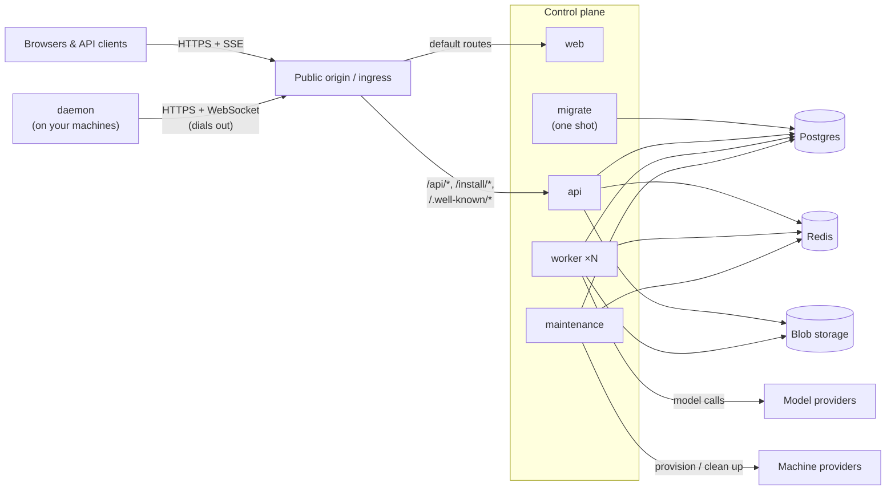

Omnara is a control plane for managed agents. Postgres owns durable product state, while each `omnarad` machine keeps the local execution state needed to recover commands it accepted. Read this before deploying or debugging a self-hosted stack.

## Processes

**web** serves the compiled single-page application. It handles browser-route history fallback but does not proxy API traffic. Deployment ingress sends default routes to `web` and the backend path prefixes `/api/*`, `/install/*`, and `/.well-known/*` to `api`, keeping both services under one public origin.

**api** (`cmd/api`) serves the entire public surface on one listener: the REST API and SSE event streams under `/api/*`, browser auth routes, the WebSocket endpoint machine daemons connect to, and — optionally — the embedded web console.

**worker** (`cmd/worker`) executes turns: it claims ready agent work, builds the model context, calls the model provider, and runs tools. Workers are global across all projects and horizontally scalable — run as many as your throughput requires. Each process creates a random UUID at startup solely to route best-effort Redis cancellation messages.

**maintenance** (`cmd/maintenance`) is the background janitor: on a fixed interval it reaps expired locks and runtimes, times out stuck work, and reconciles machine pools toward their targets.

**migrate** (`cmd/migrate`) is a one-shot process that applies the release's schema migrations and exits. Run it successfully before starting or updating the three long-running control-plane services.

**omnarad** (`cmd/daemon`) runs on each machine agents execute on, not in the control plane. It dials out to `api` — no inbound port needed — and runs commands that survive daemon restarts. Official installs live under `~/.omnarad`, use a user systemd or launchd service when available, and update in the background from the installer-recorded release manifest.

The registered daemon semantic version is the sole compatibility boundary between `omnarad` and the control plane; individual features do not invent separate protocol versions. When two released daemon versions genuinely need different behavior, the control plane branches on that one version. The current pre-release implementation instead cuts directly to one protocol and local schema rather than carrying speculative fallbacks.

Once a daemon accepts a command, it retains physical responsibility for it until Postgres resolves it. The exact detached supervisor or recoverable evidence in a per-machine SQLite state database represents that responsibility. The database contains physical execution facts and bounded report evidence, not command packages, resolved secrets, or machine credentials. On reconnect, the daemon reconciles its local claims with Postgres before accepting more work. A command whose outcome is ambiguous after acceptance becomes `unknown`; it is never made eligible to run again merely because the daemon, supervisor, connection, or reporting path failed.

## Agent runtime ownership

An agent runtime lock is the sole durable record granting a worker ownership of an agent execution. Its runtime-lock ID is the ownership epoch, and owned writes require that ID, no pending cancellation, and a lease deadline still in the future. Workers use a fixed 90-second lease, while PostgreSQL derives `started_at`, `renewed_at`, and `lease_expires_at` from its own statement time. Each successful renewal also establishes a conservative local monotonic safety budget, so worker execution does not depend on clock synchronization with PostgreSQL.

Once the stored deadline passes, the runtime lock stops authorizing writes and becomes eligible for recovery. Maintenance rechecks the lock ID and deadline while following the canonical row-lock order. A renewal that wins this race refreshes the deadline and prevents recovery. If maintenance wins, it recovers the interrupted work and deletes the lock before replacement ownership can be acquired.

MCP calls and other worker-owned network tools release ordinary turn capacity while they wait, but they do not release agent ownership. The worker keeps the same runtime lock renewed and cancellable until every asynchronous call from that turn has committed a result or reached the fixed five-minute execution limit. Each running call records that runtime-lock ID, and completion requires the same active lease. If a call is interrupted, or cancellation or recovery wins first, its external outcome is recorded as unknown and a late network response cannot overwrite that result.

The `worker_process_id` stored on an active lock is not a product identity or registry entry. It is only the Redis routing address for best-effort cancellation. The transactional `cancel_requested_at` flag remains authoritative, allowing a later renewal to recover cancellation when Redis delivery is missed.

## Stores

**Postgres** is the canonical store: every durable noun — organizations, projects, agents, events, machines, secrets — is a row. Only the one-shot `migrate` process applies schema migrations; `api`, `worker`, and `maintenance` expect the release's migrations to have completed before they start.

**Redis** carries notifications and rate limits: wakeups between processes, event fan-out to SSE streams, daemon presence, and auth rate limiting. Valkey is compatible; the local Compose file uses it.

**Blob storage** holds artifact content — file attachments and tool outputs — in an S3-compatible bucket; events reference artifacts by ID. Local development uses the Compose MinIO service.

## Next steps

<CardGroup cols={2}>
  <Card title="Deployment" icon="cloud-arrow-up" href="/self-hosting/deployment">
    Public origin, reverse proxy rules, and health checks
  </Card>
  <Card title="Configuration" icon="sliders" href="/self-hosting/configuration">
    Every environment variable, grouped
  </Card>
</CardGroup>
