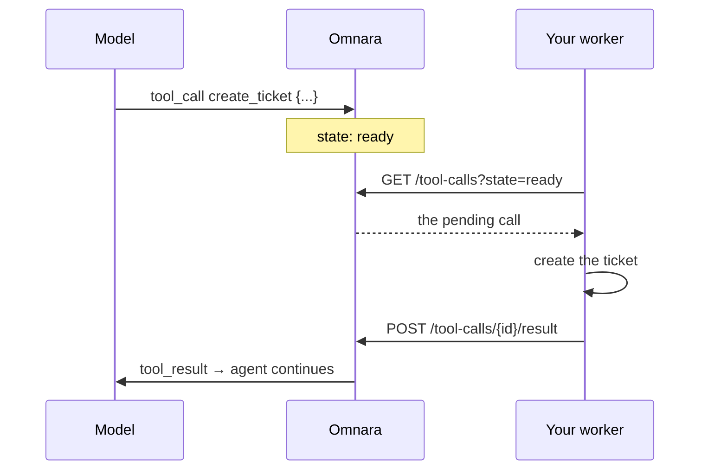

A custom tool is how an agent reaches systems only you can touch — your ticket tracker, your database, your deploy pipeline. The division of labor is clean: **you describe the tool, the model decides when to call it, and your code does the work**. Omnara sits in the middle holding the call durably until you answer it.



Because the call is a durable event, your worker can crash, redeploy, or take minutes to respond — the agent simply waits, and nothing is lost.

## Declare the tool

In the agent config, a custom tool is a name, a description, and a JSON Schema for its input. Write the description as clear instructions: explain when to use the tool, what it does, and any important limits.

```yaml
tools:
  create_ticket:
    type: custom
    description: >-
      File a ticket in the internal tracker. Use for actionable engineering
      work discovered during the conversation; keep titles under 80 chars.
    input_schema:
      type: object
      properties:
        title: { type: string }
        body: { type: string }
        priority: { type: string, enum: [low, normal, urgent] }
      required: [title]
```

Custom tools default to `always_allow`; set `permission.mode: always_ask` to put a human between the model and your system ([Tools & permissions](/tools/permissions)).

## Find calls waiting for you

`GET /tool-calls` lists an agent's tool calls, filterable by `state` and `type`. Your worker polls for ready custom calls:

```bash
curl "$OMNARA_API/orgs/$ORG/projects/$PROJ/agents/$AGENT/tool-calls?state=ready&type=custom" \
  -H "Authorization: Bearer $OMNARA_TOKEN"
```

```json
{
  "data": [
    {
      "id": "tcl_wz3jehcyd5n6a2bfgik7mv4qtr",
      "turn_id": "trn_trwz3jehcyd5n6a2bfgik7mv4q",
      "provider_call_id": "call_9f3k",
      "name": "create_ticket",
      "input": { "title": "Flaky retry logic in payments worker", "priority": "normal" },
      "type": "custom",
      "state": "ready",
      "created_at": "2026-08-03T20:15:09Z"
    }
  ],
  "next_cursor": null
}
```

`ready` means the permission check has passed and the call is waiting for your result. A custom call using `always_ask` remains in `awaiting_permission` until someone responds to its [interaction](/events/interactions). After you submit a result, it moves to `completed`.

<Tip>
To avoid continuous polling, connect to the agent's [event stream](/events/streaming), then query `GET /tool-calls?state=ready&type=custom` for already-ready calls and watch for future `tool_call_update` frames whose `state` is `ready`. Repeat the query after reconnecting because lifecycle updates are not replayed.
</Tip>

## Submit the result

Post the outcome with content blocks — text, inline media, or structured data:

```bash
curl "$OMNARA_API/orgs/$ORG/projects/$PROJ/agents/$AGENT/tool-calls/tcl_wz3jehcyd5n6a2bfgik7mv4qtr/result" \
  -H "Authorization: Bearer $OMNARA_TOKEN" \
  -H "Content-Type: application/json" \
  -d '{
    "outcome": "succeeded",
    "content_blocks": [
      { "type": "structured_data", "value": { "ticket_id": "ENG-4212", "url": "https://tracker.acme.dev/ENG-4212" } }
    ]
  }'
```

`201` returns both the completed call and the durable `tool_result` event now in the agent's timeline:

```json
{
  "tool_call": {
    "id": "tcl_wz3jehcyd5n6a2bfgik7mv4qtr",
    "name": "create_ticket",
    "type": "custom",
    "state": "completed",
    "outcome": "succeeded",
    "completed_at": "2026-08-03T20:15:31Z",
    "...": "..."
  },
  "tool_result": {
    "event_id": "evt_5n6a2bfgik7mv4qtrwz3jehcyd",
    "agent_id": "agt_v4qtrwz3jehcyd5n6a2bfgik7m",
    "tool_call_id": "tcl_wz3jehcyd5n6a2bfgik7mv4qtr",
    "outcome": "succeeded",
    "content_blocks": [ { "type": "structured_data", "value": { "ticket_id": "ENG-4212", "...": "..." } } ],
    "created_at": "2026-08-03T20:15:31Z"
  }
}
```

The agent wakes and continues its turn with your result in context. If your system failed, submit `outcome: "failed"` with a text block explaining why — a failed tool call is information the model can act on, not an error you should swallow.

Result text, structured-data string keys and values, and metadata must not contain U+0000.

**The first result wins.** Only `ready` custom calls accept results; a second submission for the same call, or a result for a built-in or MCP call, returns `409`:

```json
{ "error": "custom tool call is not ready for a result", "code": "conflict" }
```

That makes result submission naturally safe to retry from multiple workers — losers of the race get a clean `409`, not a corrupted timeline.

<Info>
Full schema and playground: [List tool calls](/api-reference/endpoints/agents/list-tool-calls) · [Submit a result](/api-reference/endpoints/agents/submit-a-result-for-a-ready-custom-tool-call).
</Info>
