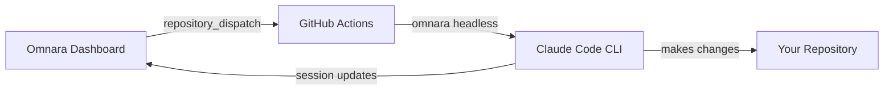

# Omnara Integration for Claude Code Action v1

This is a fork of [Claude Code Action v1.0](https://github.com/anthropics/claude-code-action) with added support for [Omnara](https://omnara.ai) - a platform that lets you monitor and interact with AI agents in real-time.

## What's Different?

This fork adds:
- **Repository dispatch support** - Trigger Claude from the Omnara dashboard via GitHub's `repository_dispatch` API
- **Session tracking** - All Claude interactions are tracked in your Omnara dashboard
- **Real-time monitoring** - See what Claude is doing as it happens
- **Two-way communication** - Claude can ask questions and receive feedback through Omnara

## Quick Start

### 1. Prerequisites

- **Anthropic API Key** - Get from [console.anthropic.com](https://console.anthropic.com)
- **Omnara API Key** - Get from [omnara.ai](https://omnara.ai)
- **GitHub PAT** - Create a Personal Access Token with `repo` scope

### 2. Add Workflow to Your Repository

Create `.github/workflows/omnara.yml`:

```yaml
name: Omnara AI Assistant

on:
  repository_dispatch:
    types: [omnara-trigger]
  issue_comment:
    types: [created]

permissions:
  contents: write
  issues: write
  pull-requests: write

jobs:
  omnara:
    runs-on: ubuntu-latest
    steps:
      - uses: actions/checkout@v4
      
      - uses: omnara-ai/omnara/integrations/github/claude-code-action-v1@main
        with:
          prompt: ${{ github.event.client_payload.prompt }}
          claude_args: |
            --max-turns 30
            --model claude-3-5-sonnet-latest
          anthropic_api_key: ${{ secrets.ANTHROPIC_API_KEY }}
        env:
          OMNARA_API_KEY: ${{ github.event.client_payload.omnara_api_key }}
          OMNARA_AGENT_INSTANCE_ID: ${{ github.event.client_payload.agent_instance_id }}
          OMNARA_AGENT_TYPE: ${{ github.event.client_payload.agent_type }}
```

### 3. Configure Repository Secrets

Add to your repository's Settings → Secrets:
- `ANTHROPIC_API_KEY` - Your Anthropic API key
- `OMNARA_API_KEY` - Your Omnara API key (optional if passing via webhook)

### 4. Set Up Omnara Dashboard

1. Go to [omnara.ai](https://omnara.ai)
2. Create a new agent with type "GitHub Webhook"
3. Configure:
   - Repository URL: `https://github.com/YOUR_ORG/YOUR_REPO`
   - PAT Token: Your GitHub Personal Access Token
   - Event Type: `omnara-trigger`
4. Launch the agent with your prompt

## How It Works



1. You launch an agent from the Omnara dashboard with a prompt
2. Omnara sends a `repository_dispatch` event to GitHub
3. GitHub Actions runs this action, which uses `omnara headless` instead of plain Claude Code
4. Omnara tracks the session and shows real-time updates in your dashboard
5. Claude makes changes to your repository as requested

## Key Features

### Automatic Mode Detection (v1.0 Feature)

The action automatically detects how to run:
- **With `prompt` input** → Runs immediately (automation mode)
- **Without `prompt` but with @claude mention** → Waits for mentions (interactive mode)
- **With Omnara** → Uses `omnara headless` for session tracking

### Session Tracking

When `OMNARA_API_KEY` is present, the action automatically:
- Installs the Omnara Python package
- Uses `omnara headless` command instead of `claude-code`
- Tracks the session in your Omnara dashboard
- Enables real-time monitoring and two-way communication

### Environment Variables

Required for Omnara integration:
- `OMNARA_API_KEY` - Your Omnara API key
- `OMNARA_AGENT_INSTANCE_ID` - Unique session ID (auto-generated if not provided)
- `OMNARA_AGENT_TYPE` - Agent name shown in dashboard (default: "GitHub Action")

## Triggering from Omnara

The webhook payload from Omnara:

```json
{
  "event_type": "omnara-trigger",
  "client_payload": {
    "prompt": "Add tests for the authentication module",
    "omnara_api_key": "YOUR_API_KEY",
    "agent_instance_id": "unique-session-id",
    "agent_type": "Claude Code"
  }
}
```

## Manual Testing

Test with curl:

```bash
curl -X POST \
  -H "Authorization: token YOUR_PAT" \
  -H "Accept: application/vnd.github.v3+json" \
  https://api.github.com/repos/YOUR_ORG/YOUR_REPO/dispatches \
  -d '{
    "event_type": "omnara-trigger",
    "client_payload": {
      "prompt": "Add a README file",
      "omnara_api_key": "YOUR_OMNARA_KEY",
      "agent_instance_id": "test-123",
      "agent_type": "Claude Code"
    }
  }'
```

## Differences from Upstream

This fork adds:
1. **`src/github/context.ts`** - Added `RepositoryDispatchEvent` type and handling
2. **`base-action/src/run-omnara.ts`** - New file that runs `omnara headless` instead of `claude-code`
3. **`base-action/src/index.ts`** - Modified to use `runOmnara` when `OMNARA_API_KEY` is present
4. **`action.yml`** - Added Omnara installation step and environment variable passing

## Using Without Omnara

This fork is fully backward compatible. To use without Omnara, simply don't set `OMNARA_API_KEY`:

```yaml
- uses: omnara-ai/omnara/integrations/github/claude-code-action-v1@main
  with:
    prompt: "Fix the failing tests"
    anthropic_api_key: ${{ secrets.ANTHROPIC_API_KEY }}
    # No OMNARA_API_KEY = uses standard Claude Code
```

## Support

- [Omnara Documentation](https://docs.omnara.ai)
- [Original Claude Code Action](https://github.com/anthropics/claude-code-action)
- [Report Issues](https://github.com/omnara-ai/omnara/issues)